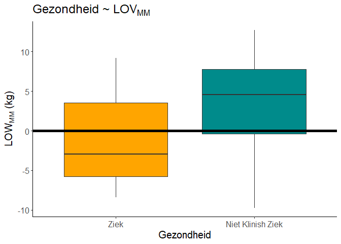
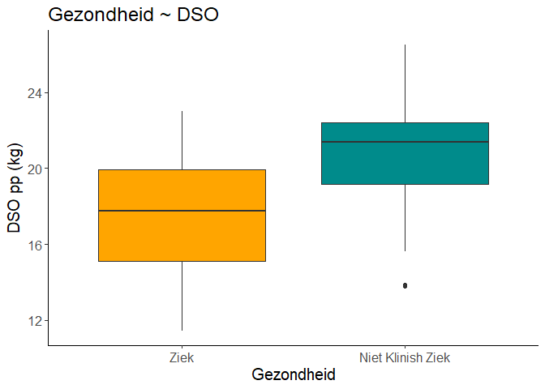
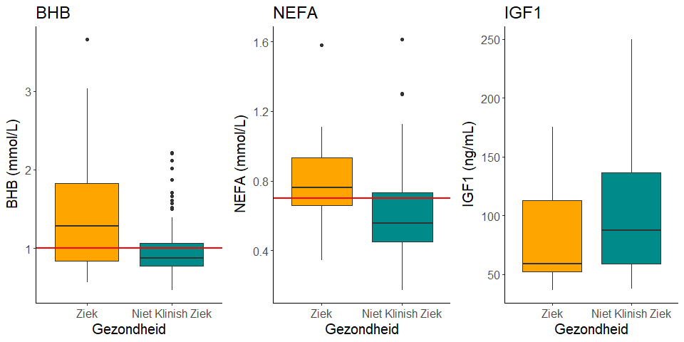
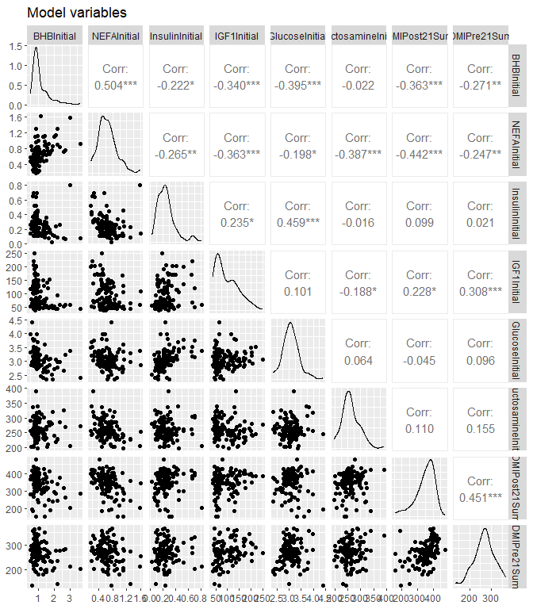
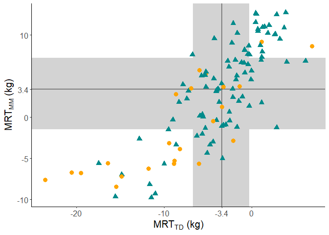
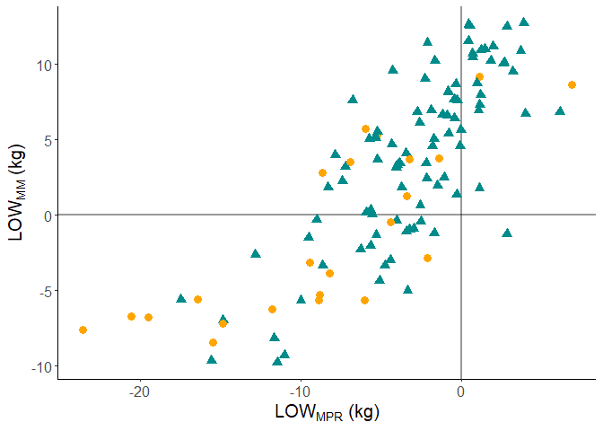
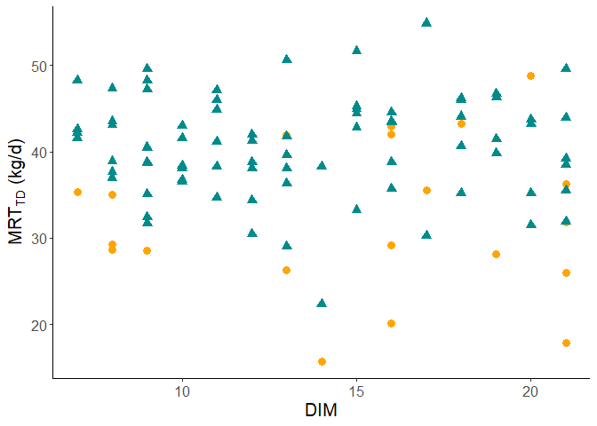

# Data

In this notebook i try to limit the DIM of the first TD in the
transition period this to see if the data shows more.

``` r
load("./DATA/finalData.RData")
load("./DATA/DryMatterDataLong.RData")
```

``` r
summary(as.factor(data$Diseased))
```

    ##  D  H 
    ## 24 91

# Features for the models

Computing mean metabolite concentration over the first 21 days

``` r
data = data  %>%
  dplyr::mutate(  BHBInitial = (BHBDay3 + BHBDay6 + BHBDay9 + BHBDay21)/4,
                  NEFAInitial = (NEFADay3 + NEFADay6 + NEFADay9 + NEFADay21)/4,
                  InsulinInitial = (InsulinDay3 + InsulinDay6 + InsulinDay9 + InsulinDay21)/4,
                  IGF1Initial = (IGF1Day3 + IGF1Day6 + IGF1Day9 + IGF1Day21)/4,
                  GlucoseInitial = (GlucoseDay3 + GlucoseDay6 + GlucoseDay9 + GlucoseDay21)/4,
                  FructosamineInitial = (FructosamineDay3 + FructosamineDay6 + FructosamineDay9 + FructosamineDay21)/4,
                  Cluster = as.factor(ClusterSH)) %>%
               dplyr:: filter(across(c("BHBInitial","NEFAInitial","InsulinInitial","IGF1Initial"), ~ !is.na(.x)))
```

mean dry matter intake Pre/Post Partum within transtion period

``` r
DryMatterPost = DryMatterDataLong %>% filter(between(DaysInMilk,0, 21)) %>%
  dplyr::group_by(Cow) %>%
  dplyr::summarise( DMIPost21Sum = sum(TotalDryMatterIntake,na.rm = T),
                    DMIPost21Avg = mean(TotalDryMatterIntake,na.rm = T))

DryMatterPre = DryMatterDataLong %>% filter(between(DaysInMilk,-21,0)) %>%
  dplyr::group_by(Cow) %>%
  dplyr::summarise( DMIPre21Sum = sum(TotalDryMatterIntake,na.rm = T),
                    DMIPre21Avg = mean(TotalDryMatterIntake,na.rm = T))
DryMatter = DryMatterPre %>% inner_join(DryMatterPost,by=("Cow"))
```

``` r
JoinedData = data %>% dplyr::inner_join(DryMatter,by= c("Cow")) %>%
  dplyr::filter(DMIPost21Sum != 0) %>%
  mutate( lactationNumber = as.integer(LactationNumber),
    lactationNumber = as.factor(case_when(
        lactationNumber == "1" ~ "1",
        lactationNumber == "2" ~ "2",
        lactationNumber == "3" ~ "3",
        TRUE ~ "4+"
        )),
    Disease = as.factor(Diseased),
    TotalSum21= TotalSum21/21)
```

# Visual representation of LOV<sup>TD</sup>


#Diseased

``` r
MEAN = mean(data$LOVTDRandom)
ggplot(data, 
      aes(x = Diseased , y = LOVTDRandom,fill = Diseased))+
      labs(title = "")+ 
      xlab(expression("Health"))+
      ylab(expression("LOV"["TD"]*"(kg)"))+ 
      scale_x_discrete(labels = c('Diseased','Not clinically Diseased'))+
      scale_fill_manual(values=c("orange", "cyan4"))+
   geom_boxplot()+theme_classic()+ theme(legend.position = "none") +geom_hline(yintercept =  0, size = 2, color = "black"  )+
theme(text = element_text(size=15))
```


``` r
MEAN = mean(data$TotalSum21)
ggplot(data, 
      aes(x = Diseased , y = TotalSum21/21,fill = Diseased))+
      labs(title = "")+ 
      xlab(expression("Health"))+
      ylab(expression("LOV"["MM"]*"(kg)"))+ 
      scale_x_discrete(labels = c('Diseased','Not clinically Diseased'))+
      scale_fill_manual(values=c("orange", "cyan4"))+
   geom_boxplot()+theme_classic()+ theme(legend.position = "none") +geom_hline(yintercept =  0, size = 2, color = "black"  )+
theme(text = element_text(size=15))
```



``` r
ggplot(JoinedData, 
      aes(x = Diseased , y = DMIPost21Avg,fill = Diseased))+
      labs(title = expression("Health ~ DMI"))+ 
      xlab(expression("Health"))+
      ylab(expression("DMI post partum (kg)"))+ 
      scale_x_discrete(labels = c('Diseased','Not clinically Diseased'))+
      scale_fill_manual(values=c("orange", "cyan4"))+
   geom_boxplot()+theme_classic()+ theme(legend.position = "none")+
theme(text = element_text(size=15))
```



``` r
BHB = ggplot(JoinedData, 
      aes(x = Diseased , y = BHBInitial,fill = Diseased))+
      labs(title = expression("BHB"))+ 
      xlab(expression("Health"))+
      ylab(expression("BHB (mmol/L)"))+ 
      scale_x_discrete(labels = c('Diseased','Not clinically Diseased'))+
      scale_fill_manual(values=c("orange", "cyan4"))+
   geom_boxplot()+theme_classic()+ theme(legend.position = "none")+geom_hline(yintercept =  1.0, size = 1, color = "red"  )+
theme(text = element_text(size=15))

NEFA = ggplot(JoinedData, 
      aes(x = Diseased , y = NEFAInitial,fill = Diseased))+
      labs(title = expression("NEFA"))+ 
      xlab(expression("Health"))+
      ylab(expression("NEFA (mmol/L)"))+ 
      scale_x_discrete(labels = c('Diseased','Not clinically Diseased'))+
      scale_fill_manual(values=c("orange", "cyan4"))+
   geom_boxplot()+theme_classic()+ theme(legend.position = "none")+geom_hline(yintercept =  0.7, size = 1, color = "red"  )+
theme(text = element_text(size=15))

IGF1 = ggplot(JoinedData, 
      aes(x = Diseased , y = IGF1Initial,fill = Diseased))+
      labs(title = expression("IGF1"))+ 
      xlab(expression("Health"))+
      ylab(expression("IGF1 (ng/mL)"))+ 
      scale_x_discrete(labels = c('Diseased','Not clinically Diseased'))+
      scale_fill_manual(values=c("orange", "cyan4"))+
   geom_boxplot()+theme_classic()+ theme(legend.position = "none")+
theme(text = element_text(size=15))


ggarrange(BHB,NEFA,IGF1,ncol = 3)
```



# LOV<sup>TD</sup> in relation to the metabolites

## Variables



``` r
MedLOWTD = round(median(JoinedData$LOVTDRandom),1)
Top25TD = round(quantile(JoinedData$LOVTDRandom,0.75),1)
Low25TD =round(quantile(JoinedData$LOVTDRandom,0.25),1)

MedLOWMM = round(median(JoinedData$TotalSum21),1)
Top25MM = round(quantile(JoinedData$TotalSum21,0.75),1)
Low25MM =round(quantile(JoinedData$TotalSum21,0.25),1)

Scatter = JoinedData %>% dplyr::select(c("LOVTDRandom","TotalSum21","Disease"))

ggplot(Scatter, aes(x=LOVTDRandom, y=TotalSum21, shape = Disease,color = Disease))+
        geom_rect(ymin = -Inf, ymax = Inf, 
              xmin = Top25TD, xmax = Low25TD, fill = 'lightgrey', color ='lightgrey')+
        geom_rect(ymin = Low25MM, ymax = Top25MM, 
              xmin = -Inf, xmax = Inf, fill = 'lightgrey', color ='lightgrey')+
      theme_classic()+
      geom_vline(xintercept = MedLOWTD, size = 1, color = "black", alpha=0.4  )+
      geom_hline(yintercept = MedLOWMM, size = 1, color = "black",alpha=0.4  )+
      geom_point(size = 3 )+
        scale_color_manual(breaks = c("D", "H"),
                        values=c("orange", "cyan4"))+ 
      scale_y_continuous(breaks = c(-10, -5, 0, MedLOWMM, 10),
                     labels = c(-10, -5, 0, MedLOWMM, 10))+ 
      scale_x_continuous(breaks = c(-20, -10,  MedLOWTD,0),
                     labels = c(-20, -10, MedLOWTD,0))+
      xlab(expression("MRT"["TD"]*" (kg)"))+
      ylab(expression("MRT"["MM"]*" (kg)"))+

    theme(text = element_text(size=15), legend.position= "None")
```



``` r
Scatter = JoinedData %>% dplyr::select(c("LOVTDRandom","TotalSum21","Disease"))

ggplot(Scatter, aes(x=LOVTDRandom, y=TotalSum21, shape = Disease,color = Disease))+
      theme_classic()+
      geom_vline(xintercept = 0, size = 1, color = "black", alpha=0.4  )+
      geom_hline(yintercept = 0, size = 1, color = "black",alpha=0.4  )+
      geom_point(size = 3, )+
        scale_color_manual(breaks = c("D", "H"),
                        values=c("orange", "cyan4"))+
      xlab(expression("MRT"["MPR"]*" (kg)"))+
      ylab(expression("MRT"["MM"]*" (kg)"))+
  
theme(text = element_text(size=15), legend.position= "None")
```



``` r
Scatter = JoinedData %>% dplyr::select(c("AmountMPRNext","DimMPRNextNRandom","Disease"))%>% dplyr::filter(AmountMPRNext != 0.0)

ggplot(Scatter, aes(x=DimMPRNextNRandom, y=AmountMPRNext, shape = Disease,color = Disease))+
      theme_classic()+
      geom_point(size = 3)+
        scale_color_manual(breaks = c("D", "H"),
                        values=c("orange", "cyan4"))+
      xlab(expression("DIM"))+
      ylab(expression("MRT"["TD"]*" (kg/d)"))+
  
theme(text = element_text(size=15), legend.position= "None")
```



``` r
cat("Mean RMTD: ",mean(JoinedData$LOVTDRandom))
```

    ## Mean RMTD:  -4.166684

``` r
cat("Standard Dev RMTD: ",sd(JoinedData$LOVTDRandom))
```

    ## Standard Dev RMTD:  5.667364

``` r
cat("Mean RMTD: ",mean(JoinedData$TotalSum21))
```

    ## Mean RMTD:  2.679308

``` r
cat(" Standard Dev RMTD: ",sd(JoinedData$TotalSum21))
```

    ##  Standard Dev RMTD:  5.990717

``` r
ModelData = JoinedData %>% dplyr::select(LOVTDRandom,BHBInitial,NEFAInitial,GlucoseInitial,IGF1Initial,FructosamineInitial,InsulinInitial,lactationNumber,DMIPost21Avg,DMIPre21Avg,Diseased) 
summary(ModelData)
```

    ##   LOVTDRandom         BHBInitial      NEFAInitial     GlucoseInitial 
    ##  Min.   :-23.6351   Min.   :0.4600   Min.   :0.1700   Min.   :2.350  
    ##  1st Qu.: -6.6509   1st Qu.:0.7806   1st Qu.:0.4775   1st Qu.:2.859  
    ##  Median : -3.3635   Median :0.9000   Median :0.6262   Median :3.050  
    ##  Mean   : -4.1667   Mean   :1.0906   Mean   :0.6466   Mean   :3.077  
    ##  3rd Qu.: -0.2796   3rd Qu.:1.2962   3rd Qu.:0.7744   3rd Qu.:3.266  
    ##  Max.   :  6.9067   Max.   :3.6625   Max.   :1.6125   Max.   :4.410  
    ##   IGF1Initial     FructosamineInitial InsulinInitial   lactationNumber
    ##  Min.   : 36.18   Min.   :197.8       Min.   :0.0250   2 :48          
    ##  1st Qu.: 55.90   1st Qu.:240.6       1st Qu.:0.1541   3 :37          
    ##  Median : 78.86   Median :256.6       Median :0.2243   4+:29          
    ##  Mean   : 97.31   Mean   :261.2       Mean   :0.2523                  
    ##  3rd Qu.:130.02   3rd Qu.:280.3       3rd Qu.:0.3003                  
    ##  Max.   :249.70   Max.   :391.3       Max.   :0.8067                  
    ##   DMIPost21Avg    DMIPre21Avg      Diseased        
    ##  Min.   :11.42   Min.   :10.12   Length:114        
    ##  1st Qu.:18.63   1st Qu.:13.48   Class :character  
    ##  Median :20.86   Median :14.41   Mode  :character  
    ##  Mean   :20.19   Mean   :14.58                     
    ##  3rd Qu.:22.19   3rd Qu.:15.81                     
    ##  Max.   :26.52   Max.   :19.31

``` r
ModelData %>% summarise( BHB=sd(BHBInitial),NEFAInitial=sd(NEFAInitial),GlucoseInitial=sd(GlucoseInitial),IGF1Initial=sd(IGF1Initial),FructosamineInitial=sd(FructosamineInitial),InsulinInitial=sd(InsulinInitial),DMIPost21Avg=sd(DMIPost21Avg,na.rm = T),DMIPre21Avg=sd(DMIPre21Avg))
```

    ## # A tibble: 1 x 8
    ##     BHB NEFAInitial GlucoseInitial IGF1Initial Fructos~1 Insul~2 DMIPo~3 DMIPr~4
    ##   <dbl>       <dbl>          <dbl>       <dbl>     <dbl>   <dbl>   <dbl>   <dbl>
    ## 1 0.543       0.273          0.342        49.1      33.1   0.144    2.99    1.99
    ## # ... with abbreviated variable names 1: FructosamineInitial,
    ## #   2: InsulinInitial, 3: DMIPost21Avg, 4: DMIPre21Avg

``` r
Diseased = ModelData%>%dplyr::filter(Diseased == "D")

underOne = count(Diseased %>%dplyr::filter(BHBInitial <= 1.0))/ count(Diseased)
1 - underOne
```

    ##           n
    ## 1 0.5652174

``` r
underOnetwo = count(Diseased %>%dplyr::filter(BHBInitial <= 1.2))/ count(Diseased)
1 - underOnetwo
```

    ##           n
    ## 1 0.5217391

``` r
underOnefour = count(Diseased %>%dplyr::filter(BHBInitial <= 1.4))/ count(Diseased)
1 - underOnefour
```

    ##           n
    ## 1 0.4347826

``` r
Healthy = ModelData%>%dplyr::filter(Diseased == "H")

underOne = count(Healthy %>%dplyr::filter(BHBInitial <= 1.0))/ count(Healthy)
1 - underOne
```

    ##           n
    ## 1 0.3296703

``` r
underOnetwo = count(Healthy %>%dplyr::filter(BHBInitial <= 1.2))/ count(Healthy)
1 - underOnetwo
```

    ##           n
    ## 1 0.1978022

``` r
underOnefour = count(Healthy %>%dplyr::filter(BHBInitial <= 1.4))/ count(Healthy)
1 - underOnefour
```

    ##           n
    ## 1 0.1428571

``` r
underOne = count(Diseased %>%dplyr::filter(NEFAInitial
 < 0.7))/ count(Diseased)
1 - underOne
```

    ##           n
    ## 1 0.6086957

``` r
underOne = count(Healthy %>%dplyr::filter(NEFAInitial
 < 0.7))/ count(Healthy)
1 - underOne
```

    ##           n
    ## 1 0.3076923

``` r
skims = JoinedData%>%dplyr::select("Achieved305Milk","AgeAtFirstCalving","CalvingInterval","lactationNumber","LOVTDRandom","TotalSum21")
skim(skims)
```

|                                                  |       |
|:-------------------------------------------------|:------|
| Name                                             | skims |
| Number of rows                                   | 114   |
| Number of columns                                | 6     |
| \_\_\_\_\_\_\_\_\_\_\_\_\_\_\_\_\_\_\_\_\_\_\_   |       |
| Column type frequency:                           |       |
| factor                                           | 1     |
| numeric                                          | 5     |
| \_\_\_\_\_\_\_\_\_\_\_\_\_\_\_\_\_\_\_\_\_\_\_\_ |       |
| Group variables                                  | None  |

Data summary

**Variable type: factor**

| skim_variable   | n_missing | complete_rate | ordered | n_unique | top_counts           |
|:--------------|---------:|------------:|:-------|--------:|:------------------|
| lactationNumber |         0 |             1 | FALSE   |        3 | 2: 48, 3: 37, 4+: 29 |

**Variable type: numeric**

| skim_variable     | n_missing | complete_rate |    mean |      sd |      p0 |     p25 |     p50 |      p75 |     p100 | hist  |
|:--------|-----:|------:|----:|----:|----:|----:|----:|----:|----:|:------------------|
| Achieved305Milk   |         0 |             1 | 9964.15 | 1592.91 | 6346.25 | 8912.75 | 9766.28 | 11065.81 | 13455.08 | ▂▆▇▃▃ |
| AgeAtFirstCalving |         0 |             1 |  802.27 |  126.64 |  652.00 |  728.25 |  767.00 |   822.75 |  1484.00 | ▇▂▁▁▁ |
| CalvingInterval   |         0 |             1 |  406.55 |   71.92 |  312.00 |  353.00 |  383.00 |   453.00 |   655.00 | ▇▅▃▁▁ |
| LOVTDRandom       |         0 |             1 |   -4.17 |    5.67 |  -23.64 |   -6.65 |   -3.36 |    -0.28 |     6.91 | ▁▂▃▇▃ |
| TotalSum21        |         0 |             1 |    2.68 |    5.99 |   -9.74 |   -1.44 |    3.43 |     7.23 |    12.70 | ▅▅▇▇▆ |

``` r
cor(JoinedData$LOVTDRandom,JoinedData$TotalSum21)
```

    ## [1] 0.7863739
