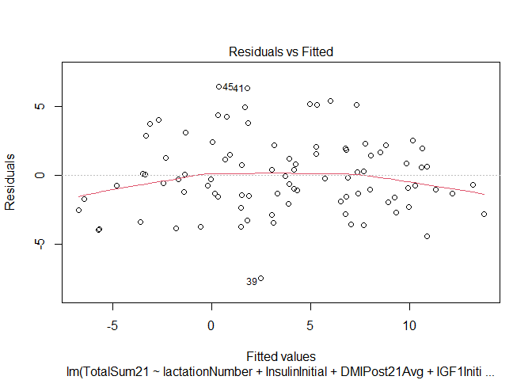
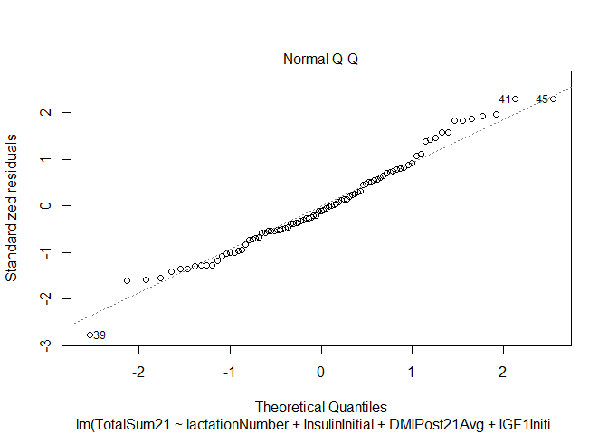

# Data

In this notebook i try to limit the DIM of the first TD in the
transition period this to see if the data shows more.

``` r
load("./DATA/finalData.RData")
load("./DATA/DryMatterDataLong.RData")
```

``` r
data = data  %>%
  dplyr::mutate(  BHBInitial = (BHBDay3 + BHBDay6 + BHBDay9 + BHBDay21)/4,
                  NEFAInitial = (NEFADay3 + NEFADay6 + NEFADay9 + NEFADay21)/4,
                  InsulinInitial = (InsulinDay3 + InsulinDay6 + InsulinDay9 + InsulinDay21)/4,
                  IGF1Initial = (IGF1Day3 + IGF1Day6 + IGF1Day9 + IGF1Day21)/4,
                  GlucoseInitial = (GlucoseDay3 + GlucoseDay6 + GlucoseDay9 + GlucoseDay21)/4,
                  FructosamineInitial = (FructosamineDay3 + FructosamineDay6 + FructosamineDay9 + FructosamineDay21)/4,
                  Cluster = as.factor(ClusterSH)) %>%
               dplyr:: filter(across(c("BHBInitial","NEFAInitial","InsulinInitial","IGF1Initial"), ~ !is.na(.x)))
```

``` r
DryMatterPost = DryMatterDataLong %>% filter(between(DaysInMilk,0, 21)) %>%
  dplyr::group_by(Cow) %>%
  dplyr::summarise( DMIPost21Sum = sum(TotalDryMatterIntake,na.rm = T),
                    DMIPost21Avg = mean(TotalDryMatterIntake,na.rm = T))

DryMatterPre = DryMatterDataLong %>% filter(between(DaysInMilk,-21,0)) %>%
  dplyr::group_by(Cow) %>%
  dplyr::summarise( DMIPre21Sum = sum(TotalDryMatterIntake,na.rm = T),
                    DMIPre21Avg = mean(TotalDryMatterIntake,na.rm = T))
DryMatter = DryMatterPre %>% inner_join(DryMatterPost,by=("Cow"))


JoinedData = data  %>% dplyr::inner_join(DryMatter,by= c("Cow"))%>%
  dplyr::filter(DMIPost21Sum != 0)%>%
  dplyr::filter(Diseased  != "D")%>%
  mutate( lactationNumber = as.integer(LactationNumber),
    lactationNumber = as.factor(case_when(
        lactationNumber == "1" ~ "1",
        lactationNumber == "2" ~ "2",
        lactationNumber == "3" ~ "3",
        TRUE ~ "4+"
        )),
   DMIPost21Sum = c(scale(DMIPost21Sum)),
   DMIPre21Sum = c(scale(DMIPre21Sum)),
   DMIPost21Avg = c(scale(DMIPost21Avg)),
   DMIPre21Avg = c(scale(DMIPre21Avg)),
   IGF1DayMinus7 = c(scale(IGF1DayMinus7)),
   BHBInitial = c(scale(BHBInitial)),
   NEFAInitial = c(scale(NEFAInitial)),
   InsulinInitial = c(scale(InsulinInitial)),
   IGF1Initial = c(scale(IGF1Initial)),
   GlucoseInitial = c(scale(GlucoseInitial)),
   FructosamineInitial = c(scale(FructosamineInitial)))
```

``` r
dataAllDays = JoinedData %>% dplyr::select(TotalSum21,lactationNumber,BHBDay3, BHBDay6 ,BHBDay9 , BHBDay21,NEFADay3 , NEFADay6 , NEFADay9 , NEFADay21,InsulinDay3 , InsulinDay6 , InsulinDay9 , InsulinDay21,IGF1Day3 , IGF1Day6 , IGF1Day9 , IGF1Day21,GlucoseDay3 , GlucoseDay6 , GlucoseDay9 , GlucoseDay21 , FructosamineDay3 , FructosamineDay6 , FructosamineDay9 , FructosamineDay21,DMIPost21Avg,DMIPre21Avg) %>% 
    dplyr::mutate( IGF1Day3 = c(scale(IGF1Day3)),
                   IGF1Day6 = c(scale(IGF1Day6)),
                   IGF1Day9 = c(scale(IGF1Day9)),
                   IGF1Day21 = c(scale(IGF1Day21)),
                   FructosamineDay3 = c(scale(FructosamineDay3)),
                   FructosamineDay6 = c(scale(FructosamineDay6)),
                   FructosamineDay9 = c(scale(FructosamineDay9)),
                   FructosamineDay21 = c(scale(FructosamineDay21)),
                   TotalSum21 = TotalSum21/21
      )
```

``` r
# Model with all variables
AllTestModel <- lm(TotalSum21 ~ ., data=dataAllDays)
vif(AllTestModel)
```

    ##                       GVIF Df GVIF^(1/(2*Df))
    ## lactationNumber   1.860750  2        1.167944
    ## BHBDay3           2.582560  1        1.607035
    ## BHBDay6           4.900344  1        2.213672
    ## BHBDay9           6.516529  1        2.552749
    ## BHBDay21          3.260691  1        1.805738
    ## NEFADay3          1.998897  1        1.413824
    ## NEFADay6          2.495788  1        1.579806
    ## NEFADay9          3.214740  1        1.792970
    ## NEFADay21         2.790418  1        1.670454
    ## InsulinDay3       2.569641  1        1.603010
    ## InsulinDay6       2.906707  1        1.704907
    ## InsulinDay9       2.175761  1        1.475046
    ## InsulinDay21      2.096403  1        1.447896
    ## IGF1Day3          5.683284  1        2.383964
    ## IGF1Day6          7.192031  1        2.681796
    ## IGF1Day9          5.438305  1        2.332017
    ## IGF1Day21         3.379332  1        1.838296
    ## GlucoseDay3       2.347265  1        1.532079
    ## GlucoseDay6       2.753935  1        1.659498
    ## GlucoseDay9       5.143840  1        2.268004
    ## GlucoseDay21      3.936242  1        1.983997
    ## FructosamineDay3  2.612578  1        1.616347
    ## FructosamineDay6  2.565960  1        1.601862
    ## FructosamineDay9  3.051715  1        1.746916
    ## FructosamineDay21 2.080801  1        1.442498
    ## DMIPost21Avg      2.508511  1        1.583828
    ## DMIPre21Avg       1.947933  1        1.395684

# linear Models

## Metabolites : one function AIC both direction selection

``` r
ModelData = JoinedData %>% dplyr::select(TotalSum21,BHBInitial,NEFAInitial,GlucoseInitial,IGF1Initial,FructosamineInitial,InsulinInitial,lactationNumber,DMIPost21Avg,DMIPre21Avg) %>% dplyr::mutate( TotalSum21 = TotalSum21/21) 
```

``` r
skim(ModelData)
```

|                                                  |           |
|:-------------------------------------------------|:----------|
| Name                                             | ModelData |
| Number of rows                                   | 91        |
| Number of columns                                | 10        |
| \_\_\_\_\_\_\_\_\_\_\_\_\_\_\_\_\_\_\_\_\_\_\_   |           |
| Column type frequency:                           |           |
| factor                                           | 1         |
| numeric                                          | 9         |
| \_\_\_\_\_\_\_\_\_\_\_\_\_\_\_\_\_\_\_\_\_\_\_\_ |           |
| Group variables                                  | None      |

Data summary

**Variable type: factor**

| skim_variable   | n_missing | complete_rate | ordered | n_unique | top_counts           |
|:--------------|---------:|------------:|:-------|--------:|:------------------|
| lactationNumber |         0 |             1 | FALSE   |        3 | 2: 40, 3: 27, 4+: 24 |

**Variable type: numeric**

| skim_variable       | n_missing | complete_rate | mean |   sd |    p0 |   p25 |   p50 |  p75 |  p100 | hist  |
|:----------|-----:|-------:|---:|---:|---:|---:|---:|---:|---:|:--------------------|
| TotalSum21          |         0 |             1 |  3.7 | 5.67 | -9.74 | -0.39 |  4.55 | 7.80 | 12.70 | ▂▅▆▇▆ |
| BHBInitial          |         0 |             1 |  0.0 | 1.00 | -1.41 | -0.59 | -0.32 | 0.17 |  3.23 | ▆▇▂▁▁ |
| NEFAInitial         |         0 |             1 |  0.0 | 1.00 | -1.66 | -0.60 | -0.20 | 0.48 |  3.83 | ▅▇▃▁▁ |
| GlucoseInitial      |         0 |             1 |  0.0 | 1.00 | -2.42 | -0.68 | -0.10 | 0.46 |  3.01 | ▂▆▇▂▁ |
| IGF1Initial         |         0 |             1 |  0.0 | 1.00 | -1.27 | -0.86 | -0.29 | 0.68 |  2.93 | ▇▅▂▂▁ |
| FructosamineInitial |         0 |             1 |  0.0 | 1.00 | -1.83 | -0.63 | -0.11 | 0.58 |  4.02 | ▃▇▃▁▁ |
| InsulinInitial      |         0 |             1 |  0.0 | 1.00 | -1.70 | -0.70 | -0.26 | 0.30 |  3.14 | ▃▇▃▁▁ |
| DMIPost21Avg        |         0 |             1 |  0.0 | 1.00 | -2.78 | -0.67 |  0.21 | 0.61 |  2.23 | ▁▃▆▇▁ |
| DMIPre21Avg         |         0 |             1 |  0.0 | 1.00 | -2.50 | -0.59 | -0.13 | 0.68 |  2.46 | ▁▅▇▅▂ |

### VIF check on main effects

``` r
# Model with all variables
AllModel <- lm(TotalSum21 ~ ., data=ModelData)
vif(AllModel)
```

    ##                         GVIF Df GVIF^(1/(2*Df))
    ## BHBInitial          1.769121  1        1.330083
    ## NEFAInitial         2.224130  1        1.491352
    ## GlucoseInitial      1.647978  1        1.283736
    ## IGF1Initial         1.506591  1        1.227433
    ## FructosamineInitial 1.572755  1        1.254095
    ## InsulinInitial      1.638770  1        1.280145
    ## lactationNumber     1.205663  2        1.047868
    ## DMIPost21Avg        1.780259  1        1.334263
    ## DMIPre21Avg         1.422551  1        1.192708

### preliminary models

``` r
# Model with all variables
AllModel <- lm(TotalSum21 ~ BHBInitial + NEFAInitial + GlucoseInitial + IGF1Initial + FructosamineInitial + InsulinInitial + lactationNumber + DMIPost21Avg + DMIPre21Avg + BHBInitial:NEFAInitial + BHBInitial:GlucoseInitial + BHBInitial:IGF1Initial + BHBInitial:FructosamineInitial + BHBInitial:InsulinInitial + BHBInitial:DMIPost21Avg + BHBInitial:DMIPre21Avg + NEFAInitial:GlucoseInitial + NEFAInitial:IGF1Initial + NEFAInitial:FructosamineInitial + NEFAInitial:InsulinInitial + NEFAInitial:DMIPost21Avg + NEFAInitial:DMIPre21Avg + GlucoseInitial:IGF1Initial + GlucoseInitial:FructosamineInitial + GlucoseInitial:InsulinInitial + GlucoseInitial:DMIPost21Avg + GlucoseInitial:DMIPre21Avg + IGF1Initial:FructosamineInitial + IGF1Initial:InsulinInitial + IGF1Initial:DMIPost21Avg + IGF1Initial:DMIPre21Avg + FructosamineInitial:InsulinInitial + FructosamineInitial:DMIPost21Avg + FructosamineInitial:DMIPre21Avg + InsulinInitial:DMIPost21Avg + InsulinInitial:DMIPre21Avg + DMIPost21Avg:DMIPre21Avg, data=ModelData)
AIC(AllModel)
```

    ## [1] 483.2171

``` r
summary(AllModel)$r.squared
```

    ## [1] 0.8452004

``` r
# Intercept only model
BaseModel <- lm(TotalSum21 ~  1, data = ModelData)
AIC(BaseModel)
```

    ## [1] 576.9889

``` r
summary(BaseModel)$r.squared
```

    ## [1] 0

### Step wise AIC based direction variable selection

``` r
BothModel <- MASS::stepAIC(BaseModel, direction = "both", 
  scope = formula(AllModel), trace=T)
```

    ## Start:  AIC=316.74
    ## TotalSum21 ~ 1
    ## 
    ##                       Df Sum of Sq    RSS    AIC
    ## + lactationNumber      2   1254.13 1637.5 268.99
    ## + GlucoseInitial       1    326.81 2564.8 307.83
    ## + InsulinInitial       1    176.53 2715.1 313.01
    ## + DMIPre21Avg          1    147.96 2743.6 313.96
    ## + DMIPost21Avg         1    127.83 2763.8 314.63
    ## + IGF1Initial          1     88.76 2802.8 315.90
    ## <none>                             2891.6 316.74
    ## + NEFAInitial          1      4.26 2887.3 318.61
    ## + BHBInitial           1      0.86 2890.7 318.72
    ## + FructosamineInitial  1      0.78 2890.8 318.72
    ## 
    ## Step:  AIC=268.99
    ## TotalSum21 ~ lactationNumber
    ## 
    ##                       Df Sum of Sq    RSS    AIC
    ## + InsulinInitial       1    289.03 1348.4 253.32
    ## + GlucoseInitial       1    285.04 1352.4 253.59
    ## + DMIPre21Avg          1    103.61 1533.8 265.05
    ## + DMIPost21Avg         1     99.89 1537.6 265.27
    ## + NEFAInitial          1     84.10 1553.4 266.20
    ## + FructosamineInitial  1     55.99 1581.5 267.83
    ## + IGF1Initial          1     41.91 1595.5 268.63
    ## <none>                             1637.5 268.99
    ## + BHBInitial           1     12.29 1625.2 270.31
    ## - lactationNumber      2   1254.13 2891.6 316.74
    ## 
    ## Step:  AIC=253.32
    ## TotalSum21 ~ lactationNumber + InsulinInitial
    ## 
    ##                       Df Sum of Sq    RSS    AIC
    ## + DMIPost21Avg         1    207.56 1140.9 240.11
    ## + DMIPre21Avg          1    156.05 1192.4 244.13
    ## + IGF1Initial          1    122.68 1225.8 246.64
    ## + GlucoseInitial       1     93.49 1255.0 248.78
    ## <none>                             1348.4 253.32
    ## + FructosamineInitial  1     27.92 1320.5 253.42
    ## + BHBInitial           1      6.75 1341.7 254.87
    ## + NEFAInitial          1      1.78 1346.7 255.20
    ## - InsulinInitial       1    289.03 1637.5 268.99
    ## - lactationNumber      2   1366.63 2715.1 313.01
    ## 
    ## Step:  AIC=240.11
    ## TotalSum21 ~ lactationNumber + InsulinInitial + DMIPost21Avg
    ## 
    ##                               Df Sum of Sq    RSS    AIC
    ## + IGF1Initial                  1    138.20 1002.7 230.36
    ## + FructosamineInitial          1    121.39 1019.5 231.88
    ## + GlucoseInitial               1     99.29 1041.6 233.83
    ## + NEFAInitial                  1     63.09 1077.8 236.94
    ## + DMIPre21Avg                  1     47.36 1093.5 238.25
    ## <none>                                     1140.9 240.11
    ## + InsulinInitial:DMIPost21Avg  1     23.34 1117.5 240.23
    ## + BHBInitial                   1      6.56 1134.3 241.59
    ## - DMIPost21Avg                 1    207.56 1348.4 253.32
    ## - InsulinInitial               1    396.69 1537.6 265.27
    ## - lactationNumber              2   1354.36 2495.2 307.33
    ## 
    ## Step:  AIC=230.36
    ## TotalSum21 ~ lactationNumber + InsulinInitial + DMIPost21Avg + 
    ##     IGF1Initial
    ## 
    ##                               Df Sum of Sq     RSS    AIC
    ## + NEFAInitial                  1    136.70  865.99 219.02
    ## + GlucoseInitial               1     87.14  915.55 224.09
    ## + FructosamineInitial          1     61.82  940.86 226.57
    ## + BHBInitial                   1     28.86  973.83 229.70
    ## <none>                                     1002.69 230.36
    ## + IGF1Initial:InsulinInitial   1     20.59  982.10 230.47
    ## + DMIPre21Avg                  1     20.18  982.51 230.51
    ## + InsulinInitial:DMIPost21Avg  1      4.60  998.09 231.94
    ## + IGF1Initial:DMIPost21Avg     1      1.60 1001.08 232.22
    ## - IGF1Initial                  1    138.20 1140.88 240.11
    ## - DMIPost21Avg                 1    223.07 1225.76 246.64
    ## - InsulinInitial               1    494.93 1497.62 264.87
    ## - lactationNumber              2   1299.01 2301.69 301.98
    ## 
    ## Step:  AIC=219.02
    ## TotalSum21 ~ lactationNumber + InsulinInitial + DMIPost21Avg + 
    ##     IGF1Initial + NEFAInitial
    ## 
    ##                               Df Sum of Sq     RSS    AIC
    ## + NEFAInitial:IGF1Initial      1     93.22  772.76 210.66
    ## + GlucoseInitial               1     67.71  798.27 213.62
    ## + NEFAInitial:DMIPost21Avg     1     55.21  810.77 215.03
    ## + NEFAInitial:InsulinInitial   1     51.54  814.45 215.44
    ## <none>                                      865.99 219.02
    ## + IGF1Initial:InsulinInitial   1     18.11  847.87 219.10
    ## + FructosamineInitial          1     17.33  848.66 219.18
    ## + IGF1Initial:DMIPost21Avg     1     12.28  853.71 219.72
    ## + DMIPre21Avg                  1     10.62  855.36 219.90
    ## + BHBInitial                   1      6.54  859.44 220.33
    ## + InsulinInitial:DMIPost21Avg  1      6.41  859.57 220.35
    ## - NEFAInitial                  1    136.70 1002.69 230.36
    ## - IGF1Initial                  1    211.81 1077.80 236.94
    ## - InsulinInitial               1    270.76 1136.75 241.78
    ## - DMIPost21Avg                 1    343.33 1209.32 247.41
    ## - lactationNumber              2   1410.80 2276.79 302.99
    ## 
    ## Step:  AIC=210.66
    ## TotalSum21 ~ lactationNumber + InsulinInitial + DMIPost21Avg + 
    ##     IGF1Initial + NEFAInitial + IGF1Initial:NEFAInitial
    ## 
    ##                               Df Sum of Sq     RSS    AIC
    ## + GlucoseInitial               1     58.42  714.34 205.51
    ## + BHBInitial                   1     28.18  744.58 209.28
    ## + NEFAInitial:InsulinInitial   1     22.88  749.89 209.93
    ## <none>                                      772.76 210.66
    ## + FructosamineInitial          1     16.76  756.00 210.66
    ## + NEFAInitial:DMIPost21Avg     1     15.11  757.65 210.86
    ## + DMIPre21Avg                  1     11.83  760.94 211.26
    ## + IGF1Initial:InsulinInitial   1      3.83  768.94 212.21
    ## + InsulinInitial:DMIPost21Avg  1      0.60  772.16 212.59
    ## + IGF1Initial:DMIPost21Avg     1      0.10  772.66 212.65
    ## - IGF1Initial:NEFAInitial      1     93.22  865.99 219.02
    ## - InsulinInitial               1    218.19  990.96 231.29
    ## - DMIPost21Avg                 1    234.00 1006.76 232.73
    ## - lactationNumber              2   1434.24 2207.01 302.16
    ## 
    ## Step:  AIC=205.51
    ## TotalSum21 ~ lactationNumber + InsulinInitial + DMIPost21Avg + 
    ##     IGF1Initial + NEFAInitial + GlucoseInitial + IGF1Initial:NEFAInitial
    ## 
    ##                                 Df Sum of Sq     RSS    AIC
    ## + NEFAInitial:GlucoseInitial     1     34.39  679.95 203.02
    ## + GlucoseInitial:InsulinInitial  1     33.68  680.66 203.11
    ## + NEFAInitial:InsulinInitial     1     26.86  687.48 204.02
    ## + DMIPre21Avg                    1     17.72  696.62 205.22
    ## <none>                                        714.34 205.51
    ## + NEFAInitial:DMIPost21Avg       1     13.71  700.64 205.74
    ## + FructosamineInitial            1     10.87  703.47 206.11
    ## + BHBInitial                     1      6.22  708.13 206.71
    ## + InsulinInitial:DMIPost21Avg    1      5.36  708.98 206.82
    ## + IGF1Initial:InsulinInitial     1      1.44  712.90 207.32
    ## + IGF1Initial:DMIPost21Avg       1      0.93  713.41 207.39
    ## + GlucoseInitial:DMIPost21Avg    1      0.02  714.32 207.50
    ## + GlucoseInitial:IGF1Initial     1      0.00  714.34 207.50
    ## - GlucoseInitial                 1     58.42  772.76 210.66
    ## - IGF1Initial:NEFAInitial        1     83.93  798.27 213.62
    ## - InsulinInitial                 1    102.76  817.10 215.74
    ## - DMIPost21Avg                   1    231.85  946.19 229.08
    ## - lactationNumber                2   1363.58 2077.93 298.67
    ## 
    ## Step:  AIC=203.02
    ## TotalSum21 ~ lactationNumber + InsulinInitial + DMIPost21Avg + 
    ##     IGF1Initial + NEFAInitial + GlucoseInitial + IGF1Initial:NEFAInitial + 
    ##     NEFAInitial:GlucoseInitial
    ## 
    ##                                 Df Sum of Sq     RSS    AIC
    ## + DMIPre21Avg                    1     15.29  664.66 202.94
    ## + BHBInitial                     1     15.21  664.74 202.96
    ## <none>                                        679.95 203.02
    ## + GlucoseInitial:InsulinInitial  1     10.27  669.68 203.63
    ## + GlucoseInitial:DMIPost21Avg    1      8.90  671.05 203.82
    ## + NEFAInitial:DMIPost21Avg       1      6.01  673.94 204.21
    ## + FructosamineInitial            1      5.84  674.11 204.23
    ## + IGF1Initial:InsulinInitial     1      3.80  676.15 204.51
    ## + NEFAInitial:InsulinInitial     1      2.14  677.81 204.73
    ## + InsulinInitial:DMIPost21Avg    1      0.83  679.12 204.91
    ## + GlucoseInitial:IGF1Initial     1      0.67  679.28 204.93
    ## + IGF1Initial:DMIPost21Avg       1      0.35  679.60 204.97
    ## - NEFAInitial:GlucoseInitial     1     34.39  714.34 205.51
    ## - InsulinInitial                 1     79.21  759.16 211.04
    ## - IGF1Initial:NEFAInitial        1     80.95  760.90 211.25
    ## - DMIPost21Avg                   1    233.41  913.36 227.87
    ## - lactationNumber                2   1236.83 1916.78 293.33
    ## 
    ## Step:  AIC=202.95
    ## TotalSum21 ~ lactationNumber + InsulinInitial + DMIPost21Avg + 
    ##     IGF1Initial + NEFAInitial + GlucoseInitial + DMIPre21Avg + 
    ##     IGF1Initial:NEFAInitial + NEFAInitial:GlucoseInitial
    ## 
    ##                                 Df Sum of Sq     RSS    AIC
    ## + BHBInitial                     1     17.11  647.55 202.57
    ## <none>                                        664.66 202.94
    ## - DMIPre21Avg                    1     15.29  679.95 203.02
    ## + GlucoseInitial:DMIPost21Avg    1      9.88  654.78 203.58
    ## + FructosamineInitial            1      9.41  655.24 203.65
    ## + InsulinInitial:DMIPre21Avg     1      9.35  655.31 203.66
    ## + GlucoseInitial:InsulinInitial  1      7.25  657.41 203.95
    ## + IGF1Initial:DMIPre21Avg        1      6.68  657.98 204.03
    ## + GlucoseInitial:DMIPre21Avg     1      4.62  660.04 204.31
    ## + NEFAInitial:DMIPost21Avg       1      2.81  661.85 204.56
    ## + IGF1Initial:InsulinInitial     1      2.71  661.94 204.57
    ## + DMIPost21Avg:DMIPre21Avg       1      1.36  663.29 204.76
    ## + NEFAInitial:DMIPre21Avg        1      1.30  663.35 204.77
    ## + NEFAInitial:InsulinInitial     1      1.28  663.38 204.77
    ## + InsulinInitial:DMIPost21Avg    1      1.11  663.55 204.79
    ## + GlucoseInitial:IGF1Initial     1      1.10  663.56 204.79
    ## + IGF1Initial:DMIPost21Avg       1      0.95  663.70 204.81
    ## - NEFAInitial:GlucoseInitial     1     31.96  696.62 205.22
    ## - InsulinInitial                 1     77.57  742.23 210.99
    ## - IGF1Initial:NEFAInitial        1     81.92  746.58 211.52
    ## - DMIPost21Avg                   1    142.44  807.09 218.62
    ## - lactationNumber                2   1228.06 1892.72 294.18
    ## 
    ## Step:  AIC=202.57
    ## TotalSum21 ~ lactationNumber + InsulinInitial + DMIPost21Avg + 
    ##     IGF1Initial + NEFAInitial + GlucoseInitial + DMIPre21Avg + 
    ##     BHBInitial + IGF1Initial:NEFAInitial + NEFAInitial:GlucoseInitial
    ## 
    ##                                 Df Sum of Sq     RSS    AIC
    ## <none>                                        647.55 202.57
    ## + FructosamineInitial            1     13.02  634.53 202.72
    ## - BHBInitial                     1     17.11  664.66 202.94
    ## - DMIPre21Avg                    1     17.20  664.74 202.96
    ## + NEFAInitial:DMIPost21Avg       1      9.30  638.25 203.26
    ## + GlucoseInitial:DMIPost21Avg    1      9.22  638.32 203.27
    ## + GlucoseInitial:InsulinInitial  1      8.88  638.67 203.31
    ## + IGF1Initial:DMIPre21Avg        1      8.30  639.25 203.40
    ## + InsulinInitial:DMIPre21Avg     1      6.33  641.22 203.68
    ## + BHBInitial:DMIPre21Avg         1      6.18  641.36 203.70
    ## + BHBInitial:GlucoseInitial      1      5.82  641.73 203.75
    ## + BHBInitial:DMIPost21Avg        1      4.13  643.41 203.99
    ## + IGF1Initial:DMIPost21Avg       1      3.40  644.15 204.09
    ## + IGF1Initial:InsulinInitial     1      3.36  644.19 204.10
    ## + DMIPost21Avg:DMIPre21Avg       1      2.67  644.87 204.20
    ## + GlucoseInitial:IGF1Initial     1      2.55  644.99 204.21
    ## + InsulinInitial:DMIPost21Avg    1      2.35  645.20 204.24
    ## + NEFAInitial:InsulinInitial     1      2.18  645.37 204.27
    ## + GlucoseInitial:DMIPre21Avg     1      2.13  645.42 204.27
    ## + BHBInitial:NEFAInitial         1      1.18  646.37 204.41
    ## + BHBInitial:IGF1Initial         1      0.46  647.09 204.51
    ## + BHBInitial:InsulinInitial      1      0.08  647.46 204.56
    ## + NEFAInitial:DMIPre21Avg        1      0.03  647.51 204.57
    ## - NEFAInitial:GlucoseInitial     1     41.29  688.84 206.20
    ## - InsulinInitial                 1     74.59  722.14 210.49
    ## - IGF1Initial:NEFAInitial        1     97.82  745.37 213.38
    ## - DMIPost21Avg                   1    154.63  802.17 220.06
    ## - lactationNumber                2   1243.16 1890.71 296.08

``` r
summary(BothModel)
```

    ## 
    ## Call:
    ## lm(formula = TotalSum21 ~ lactationNumber + InsulinInitial + 
    ##     DMIPost21Avg + IGF1Initial + NEFAInitial + GlucoseInitial + 
    ##     DMIPre21Avg + BHBInitial + IGF1Initial:NEFAInitial + NEFAInitial:GlucoseInitial, 
    ##     data = ModelData)
    ## 
    ## Residuals:
    ##     Min      1Q  Median      3Q     Max 
    ## -7.1792 -1.8595 -0.2872  1.5833  6.2834 
    ## 
    ## Coefficients:
    ##                            Estimate Std. Error t value Pr(>|t|)    
    ## (Intercept)                  8.7336     0.4904  17.809  < 2e-16 ***
    ## lactationNumber3            -7.3480     0.7625  -9.636 5.60e-15 ***
    ## lactationNumber4+           -8.3693     0.7713 -10.852  < 2e-16 ***
    ## InsulinInitial              -1.1912     0.3949  -3.017 0.003438 ** 
    ## DMIPost21Avg                 1.7625     0.4058   4.343 4.13e-05 ***
    ## IGF1Initial                  2.0607     0.3749   5.497 4.60e-07 ***
    ## NEFAInitial                  1.6263     0.4204   3.869 0.000224 ***
    ## GlucoseInitial              -0.7450     0.3928  -1.897 0.061491 .  
    ## DMIPre21Avg                  0.5155     0.3559   1.448 0.151457    
    ## BHBInitial                   0.6187     0.4283   1.445 0.152478    
    ## IGF1Initial:NEFAInitial      1.2477     0.3612   3.455 0.000889 ***
    ## NEFAInitial:GlucoseInitial   0.8277     0.3688   2.245 0.027598 *  
    ## ---
    ## Signif. codes:  0 '***' 0.001 '**' 0.01 '*' 0.05 '.' 0.1 ' ' 1
    ## 
    ## Residual standard error: 2.863 on 79 degrees of freedom
    ## Multiple R-squared:  0.7761, Adjusted R-squared:  0.7449 
    ## F-statistic: 24.89 on 11 and 79 DF,  p-value: < 2.2e-16

## Removal of non significant variables

### First step

removal: “DMIPre21Avg”

``` r
Coef1 = lm(TotalSum21 ~ lactationNumber + InsulinInitial + 
    DMIPost21Avg + IGF1Initial + NEFAInitial + GlucoseInitial + BHBInitial + IGF1Initial:NEFAInitial + NEFAInitial:GlucoseInitial ,data = ModelData)
summary(Coef1)
```

    ## 
    ## Call:
    ## lm(formula = TotalSum21 ~ lactationNumber + InsulinInitial + 
    ##     DMIPost21Avg + IGF1Initial + NEFAInitial + GlucoseInitial + 
    ##     BHBInitial + IGF1Initial:NEFAInitial + NEFAInitial:GlucoseInitial, 
    ##     data = ModelData)
    ## 
    ## Residuals:
    ##     Min      1Q  Median      3Q     Max 
    ## -7.6489 -1.6356 -0.3205  1.7025  6.4207 
    ## 
    ## Coefficients:
    ##                            Estimate Std. Error t value Pr(>|t|)    
    ## (Intercept)                  8.7361     0.4938  17.693  < 2e-16 ***
    ## lactationNumber3            -7.2667     0.7657  -9.491 9.56e-15 ***
    ## lactationNumber4+           -8.4677     0.7735 -10.947  < 2e-16 ***
    ## InsulinInitial              -1.2057     0.3975  -3.034 0.003258 ** 
    ## DMIPost21Avg                 2.0154     0.3688   5.464 5.12e-07 ***
    ## IGF1Initial                  2.1684     0.3700   5.861 9.83e-08 ***
    ## NEFAInitial                  1.7032     0.4198   4.057 0.000115 ***
    ## GlucoseInitial              -0.7065     0.3945  -1.791 0.077126 .  
    ## BHBInitial                   0.5823     0.4304   1.353 0.179929    
    ## IGF1Initial:NEFAInitial      1.2312     0.3635   3.387 0.001097 ** 
    ## NEFAInitial:GlucoseInitial   0.8478     0.3710   2.285 0.024963 *  
    ## ---
    ## Signif. codes:  0 '***' 0.001 '**' 0.01 '*' 0.05 '.' 0.1 ' ' 1
    ## 
    ## Residual standard error: 2.883 on 80 degrees of freedom
    ## Multiple R-squared:  0.7701, Adjusted R-squared:  0.7414 
    ## F-statistic:  26.8 on 10 and 80 DF,  p-value: < 2.2e-16

### Second step

removal: “BHBInitial”

``` r
Coef2 = lm(TotalSum21 ~ lactationNumber + InsulinInitial + 
    DMIPost21Avg + IGF1Initial + NEFAInitial + GlucoseInitial  + IGF1Initial:NEFAInitial + NEFAInitial:GlucoseInitial,data = ModelData)
summary(Coef2)
```

    ## 
    ## Call:
    ## lm(formula = TotalSum21 ~ lactationNumber + InsulinInitial + 
    ##     DMIPost21Avg + IGF1Initial + NEFAInitial + GlucoseInitial + 
    ##     IGF1Initial:NEFAInitial + NEFAInitial:GlucoseInitial, data = ModelData)
    ## 
    ## Residuals:
    ##     Min      1Q  Median      3Q     Max 
    ## -7.5033 -1.6884 -0.3096  1.7583  6.4699 
    ## 
    ## Coefficients:
    ##                            Estimate Std. Error t value Pr(>|t|)    
    ## (Intercept)                  8.6115     0.4876  17.662  < 2e-16 ***
    ## lactationNumber3            -7.1574     0.7653  -9.353 1.60e-14 ***
    ## lactationNumber4+           -8.4295     0.7769 -10.850  < 2e-16 ***
    ## InsulinInitial              -1.2263     0.3992  -3.072  0.00290 ** 
    ## DMIPost21Avg                 1.9147     0.3631   5.273 1.09e-06 ***
    ## IGF1Initial                  2.0099     0.3527   5.698 1.89e-07 ***
    ## NEFAInitial                  1.8028     0.4155   4.339 4.09e-05 ***
    ## GlucoseInitial              -0.9253     0.3617  -2.558  0.01239 *  
    ## IGF1Initial:NEFAInitial      1.0781     0.3472   3.105  0.00262 ** 
    ## NEFAInitial:GlucoseInitial   0.7358     0.3635   2.024  0.04626 *  
    ## ---
    ## Signif. codes:  0 '***' 0.001 '**' 0.01 '*' 0.05 '.' 0.1 ' ' 1
    ## 
    ## Residual standard error: 2.897 on 81 degrees of freedom
    ## Multiple R-squared:  0.7649, Adjusted R-squared:  0.7387 
    ## F-statistic: 29.27 on 9 and 81 DF,  p-value: < 2.2e-16

##Final Model

``` r
Final = lm(TotalSum21 ~ lactationNumber + InsulinInitial + 
    DMIPost21Avg + IGF1Initial + NEFAInitial + GlucoseInitial  + IGF1Initial:NEFAInitial + NEFAInitial:GlucoseInitial ,data = ModelData)
```

### Model Evaluation

``` r
summary(Final)
```

    ## 
    ## Call:
    ## lm(formula = TotalSum21 ~ lactationNumber + InsulinInitial + 
    ##     DMIPost21Avg + IGF1Initial + NEFAInitial + GlucoseInitial + 
    ##     IGF1Initial:NEFAInitial + NEFAInitial:GlucoseInitial, data = ModelData)
    ## 
    ## Residuals:
    ##     Min      1Q  Median      3Q     Max 
    ## -7.5033 -1.6884 -0.3096  1.7583  6.4699 
    ## 
    ## Coefficients:
    ##                            Estimate Std. Error t value Pr(>|t|)    
    ## (Intercept)                  8.6115     0.4876  17.662  < 2e-16 ***
    ## lactationNumber3            -7.1574     0.7653  -9.353 1.60e-14 ***
    ## lactationNumber4+           -8.4295     0.7769 -10.850  < 2e-16 ***
    ## InsulinInitial              -1.2263     0.3992  -3.072  0.00290 ** 
    ## DMIPost21Avg                 1.9147     0.3631   5.273 1.09e-06 ***
    ## IGF1Initial                  2.0099     0.3527   5.698 1.89e-07 ***
    ## NEFAInitial                  1.8028     0.4155   4.339 4.09e-05 ***
    ## GlucoseInitial              -0.9253     0.3617  -2.558  0.01239 *  
    ## IGF1Initial:NEFAInitial      1.0781     0.3472   3.105  0.00262 ** 
    ## NEFAInitial:GlucoseInitial   0.7358     0.3635   2.024  0.04626 *  
    ## ---
    ## Signif. codes:  0 '***' 0.001 '**' 0.01 '*' 0.05 '.' 0.1 ' ' 1
    ## 
    ## Residual standard error: 2.897 on 81 degrees of freedom
    ## Multiple R-squared:  0.7649, Adjusted R-squared:  0.7387 
    ## F-statistic: 29.27 on 9 and 81 DF,  p-value: < 2.2e-16

``` r
x = (etasq(Final))
x
```

    ##                            Partial eta^2
    ## lactationNumber               0.64526499
    ## InsulinInitial                0.10433913
    ## DMIPost21Avg                  0.25555190
    ## IGF1Initial                   0.23176590
    ## NEFAInitial                   0.14709997
    ## GlucoseInitial                0.07912307
    ## IGF1Initial:NEFAInitial       0.10639248
    ## NEFAInitial:GlucoseInitial    0.04814466
    ## Residuals                             NA

``` r
shapiro.test(Final$residuals)
```

    ## 
    ##  Shapiro-Wilk normality test
    ## 
    ## data:  Final$residuals
    ## W = 0.98066, p-value = 0.195

``` r
ols_test_breusch_pagan(Final)
```

    ## 
    ##  Breusch Pagan Test for Heteroskedasticity
    ##  -----------------------------------------
    ##  Ho: the variance is constant            
    ##  Ha: the variance is not constant        
    ## 
    ##                  Data                  
    ##  --------------------------------------
    ##  Response : TotalSum21 
    ##  Variables: fitted values of TotalSum21 
    ## 
    ##         Test Summary         
    ##  ----------------------------
    ##  DF            =    1 
    ##  Chi2          =    1.60591 
    ##  Prob > Chi2   =    0.2050677

``` r
plot(Final)
```


IGF1Initial:NEFAInitial

### unscaled Interaction Plots of final Model

``` r
DryMatterPost = DryMatterDataLong %>% filter(between(DaysInMilk,0, 21)) %>%
  dplyr::group_by(Cow) %>%
  dplyr::summarise( DMIPost21Sum = sum(TotalDryMatterIntake,na.rm = T),
                    DMIPost21Avg = mean(TotalDryMatterIntake,na.rm = T))

DryMatterPre = DryMatterDataLong %>% filter(between(DaysInMilk,-21,0)) %>%
  dplyr::group_by(Cow) %>%
  dplyr::summarise( DMIPre21Sum = sum(TotalDryMatterIntake,na.rm = T),
                    DMIPre21Avg = mean(TotalDryMatterIntake,na.rm = T))
DryMatter = DryMatterPre %>% inner_join(DryMatterPost,by=("Cow"))


unscaledDataModel = data  %>% dplyr::inner_join(DryMatter,by= c("Cow"))%>%
  dplyr::filter(DMIPost21Sum != 0)%>%
  dplyr::filter(Diseased  != "D")%>%
  mutate( lactationNumber = as.integer(LactationNumber),
    lactationNumber = as.factor(case_when(
        lactationNumber == "1" ~ "1",
        lactationNumber == "2" ~ "2",
        lactationNumber == "3" ~ "3",
        TRUE ~ "4"
        )),
                   TotalSum21 = TotalSum21/21
   ) 
UnscaledFinal = lm(TotalSum21 ~ lactationNumber + InsulinInitial + 
    DMIPost21Avg + IGF1Initial + NEFAInitial + GlucoseInitial  + IGF1Initial:NEFAInitial + NEFAInitial:GlucoseInitial,data = unscaledDataModel)
```


# Repeated Measures Check

``` r
RepeatedCows = c(234,426,492,519,567,638,639,645,655,670,689,692)
RepeatData = JoinedData %>% tidyr::separate(Cow,c("CowID","Repetition"),sep = 3) %>% filter(CowID %in% RepeatedCows) 
Correlation =  RepeatData %>%
            dplyr::mutate(pred = predict(Final,RepeatData),
                          resid = LOVTDRandom -pred) %>%
  pivot_wider(id_cols = CowID,names_from = Repetition,values_from =resid)
cor.test(Correlation$a,Correlation$b)
```

    ## 
    ##  Pearson's product-moment correlation
    ## 
    ## data:  Correlation$a and Correlation$b
    ## t = -1.0429, df = 10, p-value = 0.3216
    ## alternative hypothesis: true correlation is not equal to 0
    ## 95 percent confidence interval:
    ##  -0.7519370  0.3178426
    ## sample estimates:
    ##        cor 
    ## -0.3131877
