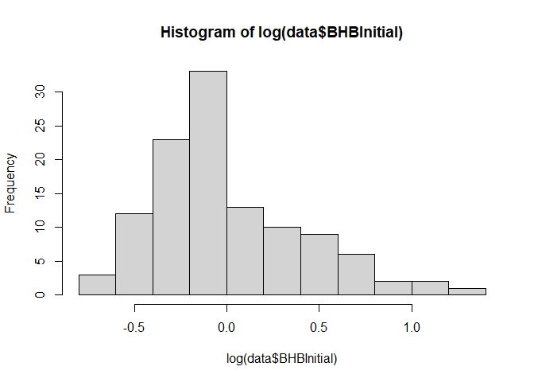
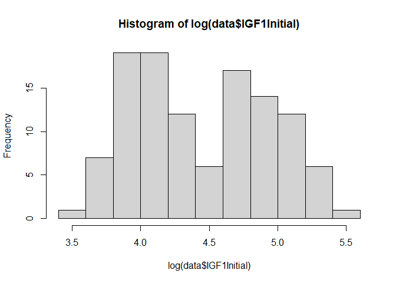
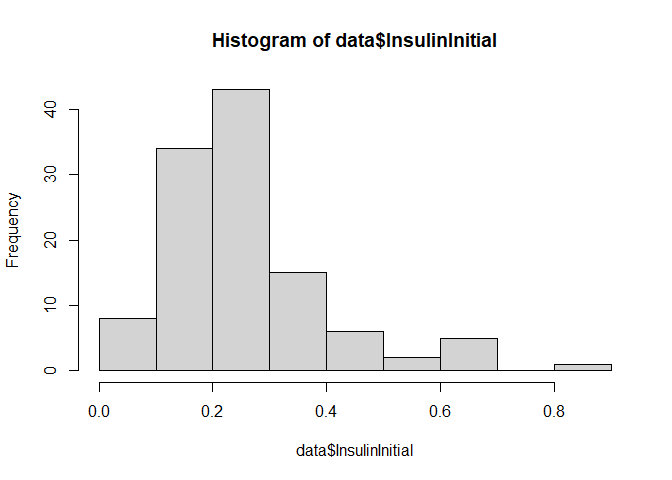

## Import Data

``` r
load("./DATA/finalData.RData")
load("./DATA/DryMatterDataLong.RData")
```

``` r
DryMatterPost = DryMatterDataLong %>% filter(between(DaysInMilk,0, 21)) %>%
  dplyr::group_by(Cow) %>%
  dplyr::summarise( DMIPost21Sum = sum(TotalDryMatterIntake,na.rm = T),
                    DMIPost21Avg = mean(TotalDryMatterIntake,na.rm = T))

DryMatterPre = DryMatterDataLong %>% filter(between(DaysInMilk,-21,0)) %>%
  dplyr::group_by(Cow) %>%
  dplyr::summarise( DMIPre21Sum = sum(TotalDryMatterIntake,na.rm = T),
                    DMIPre21Avg = mean(TotalDryMatterIntake,na.rm = T))
DryMatter = DryMatterPre %>% inner_join(DryMatterPost,by=("Cow"))


data = data  %>% dplyr::inner_join(DryMatter,by= c("Cow"))%>%
  dplyr::filter(DMIPost21Sum != 0)%>%
  mutate( 
    lactationNumber = as.integer(LactationNumber),
    lactationNumber = as.factor(case_when(
        lactationNumber == "1" ~ "1",
        lactationNumber == "2" ~ "2",
        lactationNumber == "3" ~ "3",
        TRUE ~ "4+"
        ))) %>%
  dplyr::mutate(  BHBInitial = (BHBDay3 + BHBDay6 + BHBDay9 + BHBDay21)/4,
                  NEFAInitial = (NEFADay3 + NEFADay6 + NEFADay9 + NEFADay21)/4,
                  InsulinInitial = (InsulinDay3 + InsulinDay6 + InsulinDay9 + InsulinDay21)/4,
                  IGF1Initial = (IGF1Day3 + IGF1Day6 + IGF1Day9 + IGF1Day21)/4,
                  GlucoseInitial = (GlucoseDay3 + GlucoseDay6 + GlucoseDay9 + GlucoseDay21)/4,
                  FructosamineInitial = (FructosamineDay3 + FructosamineDay6 + FructosamineDay9 + FructosamineDay21)/4,
                  TotalSum21 = TotalSum21/21)
```

# Based on Disease registration

## Prevalence of diseased in **MRT<sub>TD</sub>** distribution

``` r
Limit = nrow(data)*0.25
TopTD = data %>% filter(rank(desc(LOVTDRandom)) <= Limit) 
BottomTD = data %>% filter(rank(LOVTDRandom) <= Limit)

DataDiseased = nrow(data %>% filter(Diseased == "D"))
PrevalancedataDiseased = DataDiseased/nrow(data)
print(paste("n Perturbed : " ,DataDiseased))
```

    ## [1] "n Perturbed :  23"

``` r
print(paste("Prevalance : ", round(PrevalancedataDiseased,2)))
```

    ## [1] "Prevalance :  0.2"

### In the **top** Q

``` r
TopDiseasedTD = nrow(TopTD %>% filter(Diseased == "D"))
PrevalanceTOPTD = TopDiseasedTD/Limit
print(paste("n diseased : " ,TopDiseasedTD))
```

    ## [1] "n diseased :  2"

``` r
print(paste("Prevalance : ", round(PrevalanceTOPTD,2)))
```

    ## [1] "Prevalance :  0.07"

### In the **bottom** Q

``` r
BottomDiseasedTD = nrow(BottomTD %>% filter(Diseased == "D"))
PrevalanceBottomTD = BottomDiseasedTD/Limit
print(paste("n diseased : " ,BottomDiseasedTD))
```

    ## [1] "n diseased :  13"

``` r
print(paste("Prevalance : ", round(PrevalanceBottomTD,2)))
```

    ## [1] "Prevalance :  0.46"

## Prevalence of diseased in **MRT<sub>MM</sub>** distribution

``` r
Limit = nrow(data)*0.25
TopMM = data %>% filter(rank(desc(TotalSum21)) <= Limit) 
BottomMM = data %>% filter(rank(TotalSum21) <= Limit)
```

### In the **top** Q

``` r
TopDiseasedMM = nrow(TopMM %>% filter(Diseased == "D"))
PrevalanceTOPMM = TopDiseasedMM/Limit
print(paste("n diseased : " ,TopDiseasedMM))
```

    ## [1] "n diseased :  2"

``` r
print(paste("Prevalance : ", round(PrevalanceTOPMM,2)))
```

    ## [1] "Prevalance :  0.07"

### In the **bottom** Q

``` r
BottomDiseasedMM = nrow(BottomMM %>% filter(Diseased == "D"))
PrevalanceBottomMM = BottomDiseasedMM/Limit
print(paste("n diseased : " ,BottomDiseasedMM))
```

    ## [1] "n diseased :  13"

``` r
print(paste("Prevalance : ", round(PrevalanceBottomMM,2)))
```

    ## [1] "Prevalance :  0.46"

## Comparison of Metabolites

### Rapid Data exploration

``` r
skim(data %>% dplyr::select(Cow,Diseased,LOVTDRandom,TotalSum21,BHBInitial,NEFAInitial,GlucoseInitial,IGF1Initial,FructosamineInitial,InsulinInitial,lactationNumber,DMIPost21Avg,DMIPre21Avg) )
```

|                                                  |         |
|:-------------------------------------------------|:--------|
| Name                                             | %\>%(…) |
| Number of rows                                   | 114     |
| Number of columns                                | 13      |
| \_\_\_\_\_\_\_\_\_\_\_\_\_\_\_\_\_\_\_\_\_\_\_   |         |
| Column type frequency:                           |         |
| character                                        | 2       |
| factor                                           | 1       |
| numeric                                          | 10      |
| \_\_\_\_\_\_\_\_\_\_\_\_\_\_\_\_\_\_\_\_\_\_\_\_ |         |
| Group variables                                  | None    |

Data summary

**Variable type: character**

| skim_variable | n_missing | complete_rate | min | max | empty | n_unique | whitespace |
|:-------------|---------:|-------------:|----:|----:|------:|--------:|----------:|
| Cow           |         0 |             1 |   4 |   4 |     0 |      114 |          0 |
| Diseased      |         0 |             1 |   1 |   1 |     0 |        2 |          0 |

**Variable type: factor**

| skim_variable   | n_missing | complete_rate | ordered | n_unique | top_counts           |
|:--------------|---------:|------------:|:-------|--------:|:------------------|
| lactationNumber |         0 |             1 | FALSE   |        3 | 2: 48, 3: 37, 4+: 29 |

**Variable type: numeric**

| skim_variable       | n_missing | complete_rate |   mean |    sd |     p0 |    p25 |    p50 |    p75 |   p100 | hist  |
|:----------|-----:|-------:|----:|---:|----:|----:|----:|----:|----:|:-------------------|
| LOVTDRandom         |         0 |             1 |  -4.17 |  5.67 | -23.64 |  -6.65 |  -3.36 |  -0.28 |   6.91 | ▁▂▃▇▃ |
| TotalSum21          |         0 |             1 |   2.68 |  5.99 |  -9.74 |  -1.44 |   3.43 |   7.23 |  12.70 | ▅▅▇▇▆ |
| BHBInitial          |         0 |             1 |   1.09 |  0.54 |   0.46 |   0.78 |   0.90 |   1.30 |   3.66 | ▇▂▁▁▁ |
| NEFAInitial         |         0 |             1 |   0.65 |  0.27 |   0.17 |   0.48 |   0.63 |   0.77 |   1.61 | ▃▇▃▁▁ |
| GlucoseInitial      |         0 |             1 |   3.08 |  0.34 |   2.35 |   2.86 |   3.05 |   3.27 |   4.41 | ▂▇▅▁▁ |
| IGF1Initial         |         0 |             1 |  97.31 | 49.11 |  36.18 |  55.90 |  78.86 | 130.02 | 249.70 | ▇▃▂▂▁ |
| FructosamineInitial |         0 |             1 | 261.20 | 33.13 | 197.78 | 240.56 | 256.56 | 280.33 | 391.31 | ▃▇▃▁▁ |
| InsulinInitial      |         0 |             1 |   0.25 |  0.14 |   0.03 |   0.15 |   0.22 |   0.30 |   0.81 | ▆▇▂▁▁ |
| DMIPost21Avg        |         0 |             1 |  20.19 |  2.99 |  11.42 |  18.63 |  20.86 |  22.19 |  26.52 | ▁▂▅▇▂ |
| DMIPre21Avg         |         0 |             1 |  14.58 |  1.99 |  10.12 |  13.48 |  14.41 |  15.81 |  19.31 | ▂▅▇▃▂ |

``` r
hist(data$BHBInitial)
```



``` r
hist(data$IGF1Initial)
```



``` r
hist(data$InsulinInitial)
```



``` r
shapiro.test(data$NEFAInitial                               )
```

    ## 
    ##  Shapiro-Wilk normality test
    ## 
    ## data:  data$NEFAInitial
    ## W = 0.94734, p-value = 0.0002084

``` r
SummarisationHealthy = data %>%
  dplyr::mutate(  BHBInitial = (BHBDay3 + BHBDay6 + BHBDay9 + BHBDay21)/4,
                  NEFAInitial = (NEFADay3 + NEFADay6 + NEFADay9 + NEFADay21)/4,
                  InsulinInitial = (InsulinDay3 + InsulinDay6 + InsulinDay9 + InsulinDay21)/4,
                  IGF1Initial = (IGF1Day3 + IGF1Day6 + IGF1Day9 + IGF1Day21)/4,
                  GlucoseInitial = (GlucoseDay3 + GlucoseDay6 + GlucoseDay9 + GlucoseDay21)/4,
                  FructosamineInitial = (FructosamineDay3 + FructosamineDay6 + FructosamineDay9 + FructosamineDay21)/4) %>%
  dplyr::filter(Diseased == "H") %>% dplyr::select(DMIPre21Avg,DMIPost21Avg,LOVTDRandom,TotalSum21,BHBInitial,NEFAInitial,GlucoseInitial,IGF1Initial,FructosamineInitial,InsulinInitial,lactationNumber, LOVTDRandom,TotalSum21)
```

``` r
SummarisationDiseased= data %>%
  dplyr::mutate(  BHBInitial = (BHBDay3 + BHBDay6 + BHBDay9 + BHBDay21)/4,
                  NEFAInitial = (NEFADay3 + NEFADay6 + NEFADay9 + NEFADay21)/4,
                  InsulinInitial = (InsulinDay3 + InsulinDay6 + InsulinDay9 + InsulinDay21)/4,
                  IGF1Initial = (IGF1Day3 + IGF1Day6 + IGF1Day9 + IGF1Day21)/4,
                  GlucoseInitial = (GlucoseDay3 + GlucoseDay6 + GlucoseDay9 + GlucoseDay21)/4,
                  FructosamineInitial = (FructosamineDay3 + FructosamineDay6 + FructosamineDay9 + FructosamineDay21)/4) %>%
 dplyr::filter(Diseased == "D") %>% dplyr::select(DMIPre21Avg,DMIPost21Avg,LOVTDRandom,TotalSum21,BHBInitial,NEFAInitial,GlucoseInitial,IGF1Initial,FructosamineInitial,InsulinInitial,lactationNumber, LOVTDRandom,TotalSum21)
```

``` r
skim(SummarisationHealthy)
```

|                                                  |                      |
|:-------------------------------------------------|:---------------------|
| Name                                             | SummarisationHealthy |
| Number of rows                                   | 91                   |
| Number of columns                                | 11                   |
| \_\_\_\_\_\_\_\_\_\_\_\_\_\_\_\_\_\_\_\_\_\_\_   |                      |
| Column type frequency:                           |                      |
| factor                                           | 1                    |
| numeric                                          | 10                   |
| \_\_\_\_\_\_\_\_\_\_\_\_\_\_\_\_\_\_\_\_\_\_\_\_ |                      |
| Group variables                                  | None                 |

Data summary

**Variable type: factor**

| skim_variable   | n_missing | complete_rate | ordered | n_unique | top_counts           |
|:--------------|---------:|------------:|:-------|--------:|:------------------|
| lactationNumber |         0 |             1 | FALSE   |        3 | 2: 40, 3: 27, 4+: 24 |

**Variable type: numeric**

| skim_variable       | n_missing | complete_rate |   mean |    sd |     p0 |    p25 |    p50 |    p75 |   p100 | hist  |
|:----------|-----:|-------:|----:|---:|----:|----:|----:|----:|----:|:-------------------|
| DMIPre21Avg         |         0 |             1 |  14.76 |  1.85 |  10.12 |  13.67 |  14.52 |  16.02 |  19.31 | ▁▅▇▅▂ |
| DMIPost21Avg        |         0 |             1 |  20.86 |  2.54 |  13.80 |  19.16 |  21.40 |  22.40 |  26.52 | ▁▃▆▇▁ |
| LOVTDRandom         |         0 |             1 |  -3.05 |  4.59 | -17.48 |  -5.34 |  -2.52 |   0.22 |   6.17 | ▁▂▆▇▂ |
| TotalSum21          |         0 |             1 |   3.70 |  5.67 |  -9.74 |  -0.39 |   4.55 |   7.80 |  12.70 | ▂▅▆▇▆ |
| BHBInitial          |         0 |             1 |   1.00 |  0.38 |   0.46 |   0.77 |   0.88 |   1.06 |   2.22 | ▆▇▂▁▁ |
| NEFAInitial         |         0 |             1 |   0.61 |  0.26 |   0.17 |   0.45 |   0.55 |   0.73 |   1.61 | ▅▇▃▁▁ |
| GlucoseInitial      |         0 |             1 |   3.08 |  0.30 |   2.35 |   2.88 |   3.05 |   3.22 |   3.98 | ▂▆▇▂▁ |
| IGF1Initial         |         0 |             1 | 102.05 | 50.43 |  37.85 |  58.84 |  87.53 | 136.13 | 249.70 | ▇▅▂▂▁ |
| FructosamineInitial |         0 |             1 | 260.99 | 32.40 | 201.69 | 240.61 | 257.31 | 279.87 | 391.31 | ▃▇▃▁▁ |
| InsulinInitial      |         0 |             1 |   0.26 |  0.14 |   0.03 |   0.16 |   0.22 |   0.30 |   0.70 | ▃▇▃▁▁ |

``` r
skim(SummarisationDiseased)
```

|                                                  |                       |
|:-------------------------------------------------|:----------------------|
| Name                                             | SummarisationDiseased |
| Number of rows                                   | 23                    |
| Number of columns                                | 11                    |
| \_\_\_\_\_\_\_\_\_\_\_\_\_\_\_\_\_\_\_\_\_\_\_   |                       |
| Column type frequency:                           |                       |
| factor                                           | 1                     |
| numeric                                          | 10                    |
| \_\_\_\_\_\_\_\_\_\_\_\_\_\_\_\_\_\_\_\_\_\_\_\_ |                       |
| Group variables                                  | None                  |

Data summary

**Variable type: factor**

| skim_variable   | n_missing | complete_rate | ordered | n_unique | top_counts         |
|:--------------|---------:|------------:|:-------|--------:|:-----------------|
| lactationNumber |         0 |             1 | FALSE   |        3 | 3: 10, 2: 8, 4+: 5 |

**Variable type: numeric**

| skim_variable       | n_missing | complete_rate |   mean |    sd |     p0 |    p25 |    p50 |    p75 |   p100 | hist  |
|:----------|-----:|-------:|----:|---:|----:|----:|----:|----:|----:|:-------------------|
| DMIPre21Avg         |         0 |             1 |  13.88 |  2.38 |  10.46 |  12.03 |  13.64 |  15.04 |  18.89 | ▇▇▇▁▃ |
| DMIPost21Avg        |         0 |             1 |  17.54 |  3.24 |  11.42 |  15.11 |  17.75 |  19.93 |  23.02 | ▃▇▃▇▇ |
| LOVTDRandom         |         0 |             1 |  -8.57 |  7.32 | -23.64 | -13.34 |  -8.21 |  -3.90 |   6.91 | ▃▃▇▆▂ |
| TotalSum21          |         0 |             1 |  -1.37 |  5.61 |  -8.43 |  -5.95 |  -3.13 |   3.61 |   9.19 | ▇▂▂▃▂ |
| BHBInitial          |         0 |             1 |   1.47 |  0.86 |   0.57 |   0.84 |   1.28 |   1.83 |   3.66 | ▇▅▂▂▁ |
| NEFAInitial         |         0 |             1 |   0.80 |  0.26 |   0.34 |   0.66 |   0.76 |   0.93 |   1.58 | ▂▇▃▂▁ |
| GlucoseInitial      |         0 |             1 |   3.07 |  0.48 |   2.35 |   2.74 |   3.10 |   3.33 |   4.41 | ▇▇▇▂▁ |
| IGF1Initial         |         0 |             1 |  78.56 | 39.04 |  36.18 |  52.20 |  58.78 | 112.88 | 174.94 | ▇▂▁▃▁ |
| FructosamineInitial |         0 |             1 | 262.04 | 36.60 | 197.78 | 241.68 | 251.69 | 278.30 | 337.90 | ▂▇▃▂▃ |
| InsulinInitial      |         0 |             1 |   0.22 |  0.16 |   0.06 |   0.11 |   0.16 |   0.27 |   0.81 | ▇▆▁▁▁ |

``` r
Lactation= data %>%
  dplyr::mutate(  BHBInitial = (BHBDay3 + BHBDay6 + BHBDay9 + BHBDay21)/4,
                  NEFAInitial = (NEFADay3 + NEFADay6 + NEFADay9 + NEFADay21)/4,
                  InsulinInitial = (InsulinDay3 + InsulinDay6 + InsulinDay9 + InsulinDay21)/4,
                  IGF1Initial = (IGF1Day3 + IGF1Day6 + IGF1Day9 + IGF1Day21)/4,
                  GlucoseInitial = (GlucoseDay3 + GlucoseDay6 + GlucoseDay9 + GlucoseDay21)/4,
                  FructosamineInitial = (FructosamineDay3 + FructosamineDay6 + FructosamineDay9 + FructosamineDay21)/4) %>% dplyr::select(lactationNumber, LOVTDRandom,TotalSum21,Diseased)
skim(Lactation %>% dplyr::filter(Diseased == "D"))
```

|                                                  |                             |
|:-------------------------------------------------|:----------------------------|
| Name                                             | Lactation %\>% dplyr::filt… |
| Number of rows                                   | 23                          |
| Number of columns                                | 4                           |
| \_\_\_\_\_\_\_\_\_\_\_\_\_\_\_\_\_\_\_\_\_\_\_   |                             |
| Column type frequency:                           |                             |
| character                                        | 1                           |
| factor                                           | 1                           |
| numeric                                          | 2                           |
| \_\_\_\_\_\_\_\_\_\_\_\_\_\_\_\_\_\_\_\_\_\_\_\_ |                             |
| Group variables                                  | None                        |

Data summary

**Variable type: character**

| skim_variable | n_missing | complete_rate | min | max | empty | n_unique | whitespace |
|:-------------|---------:|-------------:|----:|----:|------:|--------:|----------:|
| Diseased      |         0 |             1 |   1 |   1 |     0 |        1 |          0 |

**Variable type: factor**

| skim_variable   | n_missing | complete_rate | ordered | n_unique | top_counts         |
|:--------------|---------:|------------:|:-------|--------:|:-----------------|
| lactationNumber |         0 |             1 | FALSE   |        3 | 3: 10, 2: 8, 4+: 5 |

**Variable type: numeric**

| skim_variable | n_missing | complete_rate |  mean |   sd |     p0 |    p25 |   p50 |   p75 | p100 | hist  |
|:-------|-----:|-------:|---:|---:|----:|----:|---:|---:|---:|:---------------------|
| LOVTDRandom   |         0 |             1 | -8.57 | 7.32 | -23.64 | -13.34 | -8.21 | -3.90 | 6.91 | ▃▃▇▆▂ |
| TotalSum21    |         0 |             1 | -1.37 | 5.61 |  -8.43 |  -5.95 | -3.13 |  3.61 | 9.19 | ▇▂▂▃▂ |

``` r
skim(Lactation %>% dplyr::filter(Diseased == "D") %>% dplyr::group_by(lactationNumber))
```

|                                                  |                             |
|:-------------------------------------------------|:----------------------------|
| Name                                             | Lactation %\>% dplyr::filt… |
| Number of rows                                   | 23                          |
| Number of columns                                | 4                           |
| \_\_\_\_\_\_\_\_\_\_\_\_\_\_\_\_\_\_\_\_\_\_\_   |                             |
| Column type frequency:                           |                             |
| character                                        | 1                           |
| numeric                                          | 2                           |
| \_\_\_\_\_\_\_\_\_\_\_\_\_\_\_\_\_\_\_\_\_\_\_\_ |                             |
| Group variables                                  | lactationNumber             |

Data summary

**Variable type: character**

| skim_variable | lactationNumber | n_missing | complete_rate | min | max | empty | n_unique | whitespace |
|:----------|:------------|--------:|----------:|---:|---:|-----:|-------:|--------:|
| Diseased      | 2               |         0 |             1 |   1 |   1 |     0 |        1 |          0 |
| Diseased      | 3               |         0 |             1 |   1 |   1 |     0 |        1 |          0 |
| Diseased      | 4+              |         0 |             1 |   1 |   1 |     0 |        1 |          0 |

**Variable type: numeric**

| skim_variable | lactationNumber | n_missing | complete_rate |   mean |   sd |     p0 |    p25 |   p50 |   p75 |  p100 | hist  |
|:------|:-------|-----:|------:|---:|---:|---:|---:|---:|---:|---:|:------------------|
| LOVTDRandom   | 2               |         0 |             1 |  -8.24 | 8.64 | -23.64 | -10.06 | -5.19 | -3.35 |  1.12 | ▅▁▁▇▇ |
| LOVTDRandom   | 3               |         0 |             1 |  -7.47 | 7.44 | -16.43 | -14.10 | -7.11 | -2.89 |  6.91 | ▇▂▃▃▂ |
| LOVTDRandom   | 4+              |         0 |             1 | -11.28 | 5.22 | -20.61 |  -9.42 | -8.88 | -8.82 | -8.66 | ▂▁▁▁▇ |
| TotalSum21    | 2               |         0 |             1 |   1.08 | 5.85 |  -7.59 |  -2.05 |  2.39 |  4.22 |  9.19 | ▅▁▅▇▂ |
| TotalSum21    | 3               |         0 |             1 |  -2.21 | 5.92 |  -8.43 |  -6.09 | -4.74 |  2.13 |  8.64 | ▇▃▁▂▃ |
| TotalSum21    | 4+              |         0 |             1 |  -3.58 | 3.80 |  -6.69 |  -5.62 | -5.29 | -3.13 |  2.81 | ▇▂▁▁▂ |

``` r
skim(Lactation %>% dplyr::filter(Diseased == "H"))
```

|                                                  |                             |
|:-------------------------------------------------|:----------------------------|
| Name                                             | Lactation %\>% dplyr::filt… |
| Number of rows                                   | 91                          |
| Number of columns                                | 4                           |
| \_\_\_\_\_\_\_\_\_\_\_\_\_\_\_\_\_\_\_\_\_\_\_   |                             |
| Column type frequency:                           |                             |
| character                                        | 1                           |
| factor                                           | 1                           |
| numeric                                          | 2                           |
| \_\_\_\_\_\_\_\_\_\_\_\_\_\_\_\_\_\_\_\_\_\_\_\_ |                             |
| Group variables                                  | None                        |

Data summary

**Variable type: character**

| skim_variable | n_missing | complete_rate | min | max | empty | n_unique | whitespace |
|:-------------|---------:|-------------:|----:|----:|------:|--------:|----------:|
| Diseased      |         0 |             1 |   1 |   1 |     0 |        1 |          0 |

**Variable type: factor**

| skim_variable   | n_missing | complete_rate | ordered | n_unique | top_counts           |
|:--------------|---------:|------------:|:-------|--------:|:------------------|
| lactationNumber |         0 |             1 | FALSE   |        3 | 2: 40, 3: 27, 4+: 24 |

**Variable type: numeric**

| skim_variable | n_missing | complete_rate |  mean |   sd |     p0 |   p25 |   p50 |  p75 |  p100 | hist  |
|:--------|------:|--------:|----:|---:|----:|----:|----:|---:|----:|:---------------------|
| LOVTDRandom   |         0 |             1 | -3.05 | 4.59 | -17.48 | -5.34 | -2.52 | 0.22 |  6.17 | ▁▂▆▇▂ |
| TotalSum21    |         0 |             1 |  3.70 | 5.67 |  -9.74 | -0.39 |  4.55 | 7.80 | 12.70 | ▂▅▆▇▆ |

``` r
skim(Lactation %>% dplyr::filter(Diseased == "H") %>% dplyr::group_by(lactationNumber))
```

|                                                  |                             |
|:-------------------------------------------------|:----------------------------|
| Name                                             | Lactation %\>% dplyr::filt… |
| Number of rows                                   | 91                          |
| Number of columns                                | 4                           |
| \_\_\_\_\_\_\_\_\_\_\_\_\_\_\_\_\_\_\_\_\_\_\_   |                             |
| Column type frequency:                           |                             |
| character                                        | 1                           |
| numeric                                          | 2                           |
| \_\_\_\_\_\_\_\_\_\_\_\_\_\_\_\_\_\_\_\_\_\_\_\_ |                             |
| Group variables                                  | lactationNumber             |

Data summary

**Variable type: character**

| skim_variable | lactationNumber | n_missing | complete_rate | min | max | empty | n_unique | whitespace |
|:----------|:------------|--------:|----------:|---:|---:|-----:|-------:|--------:|
| Diseased      | 2               |         0 |             1 |   1 |   1 |     0 |        1 |          0 |
| Diseased      | 3               |         0 |             1 |   1 |   1 |     0 |        1 |          0 |
| Diseased      | 4+              |         0 |             1 |   1 |   1 |     0 |        1 |          0 |

**Variable type: numeric**

| skim_variable | lactationNumber | n_missing | complete_rate |  mean |   sd |     p0 |   p25 |   p50 |   p75 |  p100 | hist  |
|:-------|:-------|-----:|-------:|---:|---:|----:|---:|---:|---:|---:|:------------------|
| LOVTDRandom   | 2               |         0 |             1 | -1.60 | 3.65 | -12.84 | -3.94 | -0.42 |  1.02 |  3.91 | ▁▂▅▇▇ |
| LOVTDRandom   | 3               |         0 |             1 | -2.96 | 5.23 | -15.58 | -5.25 | -2.74 |  0.18 |  6.17 | ▂▂▇▇▅ |
| LOVTDRandom   | 4+              |         0 |             1 | -5.59 | 4.29 | -17.48 | -7.80 | -4.59 | -2.54 | -0.01 | ▁▂▂▆▇ |
| TotalSum21    | 2               |         0 |             1 |  7.69 | 3.57 |  -2.64 |  5.22 |  7.64 | 10.51 | 12.70 | ▁▁▆▇▇ |
| TotalSum21    | 3               |         0 |             1 |  2.01 | 5.06 |  -9.63 | -1.27 |  2.43 |  6.05 | 10.88 | ▂▃▇▅▅ |
| TotalSum21    | 4+              |         0 |             1 | -1.04 | 4.55 |  -9.74 | -3.58 | -0.65 |  1.57 |  6.63 | ▃▃▇▃▅ |

``` r
skim(Lactation)
```

|                                                  |           |
|:-------------------------------------------------|:----------|
| Name                                             | Lactation |
| Number of rows                                   | 114       |
| Number of columns                                | 4         |
| \_\_\_\_\_\_\_\_\_\_\_\_\_\_\_\_\_\_\_\_\_\_\_   |           |
| Column type frequency:                           |           |
| character                                        | 1         |
| factor                                           | 1         |
| numeric                                          | 2         |
| \_\_\_\_\_\_\_\_\_\_\_\_\_\_\_\_\_\_\_\_\_\_\_\_ |           |
| Group variables                                  | None      |

Data summary

**Variable type: character**

| skim_variable | n_missing | complete_rate | min | max | empty | n_unique | whitespace |
|:-------------|---------:|-------------:|----:|----:|------:|--------:|----------:|
| Diseased      |         0 |             1 |   1 |   1 |     0 |        2 |          0 |

**Variable type: factor**

| skim_variable   | n_missing | complete_rate | ordered | n_unique | top_counts           |
|:--------------|---------:|------------:|:-------|--------:|:------------------|
| lactationNumber |         0 |             1 | FALSE   |        3 | 2: 48, 3: 37, 4+: 29 |

**Variable type: numeric**

| skim_variable | n_missing | complete_rate |  mean |   sd |     p0 |   p25 |   p50 |   p75 |  p100 | hist  |
|:-------|-----:|-------:|---:|---:|----:|---:|---:|---:|---:|:---------------------|
| LOVTDRandom   |         0 |             1 | -4.17 | 5.67 | -23.64 | -6.65 | -3.36 | -0.28 |  6.91 | ▁▂▃▇▃ |
| TotalSum21    |         0 |             1 |  2.68 | 5.99 |  -9.74 | -1.44 |  3.43 |  7.23 | 12.70 | ▅▅▇▇▆ |

``` r
skim(data%>%group_by(Diseased))
```

|                                                  |                             |
|:-------------------------------------------------|:----------------------------|
| Name                                             | data %\>% group_by(Disease… |
| Number of rows                                   | 114                         |
| Number of columns                                | 179                         |
| \_\_\_\_\_\_\_\_\_\_\_\_\_\_\_\_\_\_\_\_\_\_\_   |                             |
| Column type frequency:                           |                             |
| character                                        | 27                          |
| Date                                             | 1                           |
| factor                                           | 1                           |
| numeric                                          | 149                         |
| \_\_\_\_\_\_\_\_\_\_\_\_\_\_\_\_\_\_\_\_\_\_\_\_ |                             |
| Group variables                                  | Diseased                    |

Data summary

**Variable type: character**

| skim_variable                          | Diseased | n_missing | complete_rate |  min |  max | empty | n_unique | whitespace |
|:-----------------------|:------|------:|---------:|---:|---:|----:|------:|-------:|
| Cow                                    | D        |         0 |          1.00 |    4 |    4 |     0 |       23 |          0 |
| Cow                                    | H        |         0 |          1.00 |    4 |    4 |     0 |       91 |          0 |
| DateDayMinus7                          | D        |         0 |          1.00 |   10 |   10 |     0 |       20 |          0 |
| DateDayMinus7                          | H        |         0 |          1.00 |   10 |   10 |     0 |       77 |          0 |
| DateDay3                               | D        |         0 |          1.00 |   10 |   10 |     0 |       23 |          0 |
| DateDay3                               | H        |         0 |          1.00 |   10 |   10 |     0 |       86 |          0 |
| DateDay6                               | D        |         0 |          1.00 |   10 |   10 |     0 |       21 |          0 |
| DateDay6                               | H        |         0 |          1.00 |   10 |   10 |     0 |       84 |          0 |
| DateDay9                               | D        |         0 |          1.00 |   10 |   10 |     0 |       22 |          0 |
| DateDay9                               | H        |         0 |          1.00 |   10 |   10 |     0 |       81 |          0 |
| DateDay21                              | D        |         0 |          1.00 |   10 |   10 |     0 |       23 |          0 |
| DateDay21                              | H        |         0 |          1.00 |   10 |   10 |     0 |       80 |          0 |
| ClusterFPCM                            | D        |         0 |          1.00 |    1 |    1 |     0 |        2 |          0 |
| ClusterFPCM                            | H        |         0 |          1.00 |    1 |    1 |     0 |        2 |          0 |
| ClusterBloodxClusterFPCM               | D        |         0 |          1.00 |    3 |    3 |     0 |        4 |          0 |
| ClusterBloodxClusterFPCM               | H        |         0 |          1.00 |    3 |    3 |     0 |        4 |          0 |
| HealthStatus                           | D        |         0 |          1.00 |    3 |    3 |     0 |        1 |          0 |
| HealthStatus                           | H        |        91 |          0.00 |   NA |   NA |     0 |        0 |          0 |
| ClusterAndHealthStatus                 | D        |         0 |          1.00 |    8 |    8 |     0 |        1 |          0 |
| ClusterAndHealthStatus                 | H        |         0 |          1.00 |    1 |    1 |     0 |        2 |          0 |
| ClusterSubsetParametersAndHealthStatus | D        |         0 |          1.00 |    8 |    8 |     0 |        1 |          0 |
| ClusterSubsetParametersAndHealthStatus | H        |         0 |          1.00 |    1 |    1 |     0 |        2 |          0 |
| Range                                  | D        |         0 |          1.00 |   16 |   17 |     0 |       23 |          0 |
| Range                                  | H        |         0 |          1.00 |   16 |   19 |     0 |       89 |          0 |
| SequenceAmountMilked                   | D        |         0 |          1.00 |  201 |  231 |     0 |       23 |          0 |
| SequenceAmountMilked                   | H        |         0 |          1.00 |  201 |  224 |     0 |       91 |          0 |
| SmoothedSequenceMM                     | D        |         0 |          1.00 | 1314 | 2111 |     0 |       23 |          0 |
| SmoothedSequenceMM                     | H        |         0 |          1.00 | 1584 | 2114 |     0 |       91 |          0 |
| Date                                   | D        |         0 |          1.00 |   10 |   10 |     0 |       21 |          0 |
| Date                                   | H        |        91 |          0.00 |   NA |   NA |     0 |        0 |          0 |
| Disease1                               | D        |         0 |          1.00 |    5 |   12 |     0 |        7 |          0 |
| Disease1                               | H        |        91 |          0.00 |   NA |   NA |     0 |        0 |          0 |
| Disease2                               | D        |         8 |          0.65 |    5 |   12 |     0 |        6 |          0 |
| Disease2                               | H        |        91 |          0.00 |   NA |   NA |     0 |        0 |          0 |
| Disease3                               | D        |        17 |          0.26 |    7 |    8 |     0 |        3 |          0 |
| Disease3                               | H        |        91 |          0.00 |   NA |   NA |     0 |        0 |          0 |
| nextMILK                               | D        |         0 |          1.00 | 3107 | 3381 |     0 |       23 |          0 |
| nextMILK                               | H        |         0 |          1.00 | 3104 | 3387 |     0 |       91 |          0 |
| PerturbationIndicator21                | D        |         0 |          1.00 |    9 |   11 |     0 |        2 |          0 |
| PerturbationIndicator21                | H        |         0 |          1.00 |    9 |   11 |     0 |        2 |          0 |
| PerturbationDay21                      | D        |         0 |          1.00 |    2 |   62 |     0 |       11 |          0 |
| PerturbationDay21                      | H        |         0 |          1.00 |    2 |   32 |     0 |       12 |          0 |
| PerturbationPeriod21                   | D        |         0 |          1.00 |    2 |    7 |     0 |        8 |          0 |
| PerturbationPeriod21                   | H        |         0 |          1.00 |    2 |   13 |     0 |       10 |          0 |
| PerturbationIndicator50                | D        |         0 |          1.00 |    9 |   11 |     0 |        2 |          0 |
| PerturbationIndicator50                | H        |         0 |          1.00 |    9 |   11 |     0 |        2 |          0 |
| PerturbationDay50                      | D        |         0 |          1.00 |    2 |  116 |     0 |       16 |          0 |
| PerturbationDay50                      | H        |         0 |          1.00 |    2 |   68 |     0 |       22 |          0 |
| PerturbationPeriod50                   | D        |         0 |          1.00 |    2 |   13 |     0 |       15 |          0 |
| PerturbationPeriod50                   | H        |         0 |          1.00 |    2 |    7 |     0 |       22 |          0 |
| EstimationNextMilk                     | D        |         0 |          1.00 |    5 |    8 |     0 |        3 |          0 |
| EstimationNextMilk                     | H        |         0 |          1.00 |    5 |    8 |     0 |        3 |          0 |
| PerturbationIndicator35                | D        |         0 |          1.00 |    9 |   11 |     0 |        2 |          0 |
| PerturbationIndicator35                | H        |         0 |          1.00 |    9 |   11 |     0 |        2 |          0 |

**Variable type: Date**

| skim_variable | Diseased | n_missing | complete_rate | min        | max        | median     | n_unique |
|:----------|:-------|--------:|----------:|:--------|:--------|:--------|-------:|
| CalvingDate   | D        |         0 |             1 | 2018-11-17 | 2020-05-24 | 2019-06-07 |       23 |
| CalvingDate   | H        |         0 |             1 | 2018-11-20 | 2020-09-04 | 2019-08-28 |       86 |

**Variable type: factor**

| skim_variable   | Diseased | n_missing | complete_rate | ordered | n_unique | top_counts           |
|:------------|:-------|--------:|-----------:|:------|-------:|:----------------|
| lactationNumber | D        |         0 |             1 | FALSE   |        3 | 3: 10, 2: 8, 4+: 5   |
| lactationNumber | H        |         0 |             1 | FALSE   |        3 | 2: 40, 3: 27, 4+: 24 |

**Variable type: numeric**

| skim_variable               | Diseased | n_missing | complete_rate |          mean |            sd |          p0 |           p25 |           p50 |           p75 |          p100 | hist  |
|:---------|:---|----:|-----:|----:|----:|----:|----:|----:|----:|----:|:-------------|
| …1                          | D        |         0 |          1.00 |         48.83 |         31.66 |        3.00 |         26.00 |         41.00 |         66.00 |        110.00 | ▅▇▂▂▃ |
| …1                          | H        |         0 |          1.00 |         61.40 |         33.94 |        1.00 |         34.50 |         64.00 |         88.50 |        117.00 | ▇▆▇▇▇ |
| SAA                         | D        |         0 |          1.00 |        108.04 |        122.19 |        0.41 |          9.55 |         39.34 |        199.47 |        312.92 | ▇▁▂▁▃ |
| SAA                         | H        |         0 |          1.00 |         43.51 |         65.19 |        0.00 |          5.15 |         14.62 |         52.74 |        277.22 | ▇▂▁▁▁ |
| Hp                          | D        |         0 |          1.00 |          0.37 |          0.58 |        0.00 |          0.11 |          0.16 |          0.32 |          2.71 | ▇▁▁▁▁ |
| Hp                          | H        |         0 |          1.00 |          0.21 |          0.27 |        0.00 |          0.10 |          0.13 |          0.20 |          1.77 | ▇▁▁▁▁ |
| GlucoseDayMinus7            | D        |         4 |          0.83 |          3.68 |          0.28 |        3.09 |          3.52 |          3.59 |          3.83 |          4.37 | ▁▇▃▃▁ |
| GlucoseDayMinus7            | H        |        14 |          0.85 |          3.80 |          0.42 |        3.01 |          3.53 |          3.73 |          3.93 |          6.05 | ▅▇▁▁▁ |
| BHBDayMinus7                | D        |         1 |          0.96 |          0.65 |          0.17 |        0.19 |          0.56 |          0.65 |          0.76 |          0.94 | ▁▁▇▇▂ |
| BHBDayMinus7                | H        |        13 |          0.86 |          0.66 |          0.13 |        0.28 |          0.56 |          0.64 |          0.71 |          0.93 | ▁▅▇▆▃ |
| NEFADayMinus7               | D        |         1 |          0.96 |          0.22 |          0.13 |        0.01 |          0.13 |          0.23 |          0.28 |          0.46 | ▃▇▇▁▅ |
| NEFADayMinus7               | H        |        13 |          0.86 |          0.17 |          0.14 |        0.01 |          0.10 |          0.14 |          0.18 |          0.79 | ▇▃▁▁▁ |
| InsulinDayMinus7            | D        |         1 |          0.96 |          0.71 |          0.32 |        0.26 |          0.51 |          0.64 |          0.95 |          1.55 | ▆▇▃▃▁ |
| InsulinDayMinus7            | H        |        13 |          0.86 |          1.07 |          0.58 |        0.16 |          0.74 |          0.94 |          1.30 |          3.47 | ▆▇▂▁▁ |
| IGF1DayMinus7               | D        |         1 |          0.96 |         96.00 |         42.68 |       47.26 |         65.14 |         74.04 |        133.04 |        189.80 | ▇▁▁▃▁ |
| IGF1DayMinus7               | H        |        13 |          0.86 |        130.65 |         67.40 |       40.03 |         74.10 |        114.68 |        182.43 |        249.70 | ▇▅▃▃▅ |
| FructosamineDayMinus7       | D        |         1 |          0.96 |        304.60 |         51.70 |      205.90 |        276.63 |        293.86 |        325.58 |        423.29 | ▂▇▇▁▃ |
| FructosamineDayMinus7       | H        |        13 |          0.86 |        283.77 |         46.99 |      205.50 |        249.34 |        284.17 |        313.51 |        403.99 | ▅▇▇▃▂ |
| GlucoseDay3                 | D        |         0 |          1.00 |          3.18 |          0.55 |        1.72 |          2.84 |          3.18 |          3.44 |          4.08 | ▁▂▃▇▃ |
| GlucoseDay3                 | H        |         0 |          1.00 |          3.23 |          0.43 |        1.68 |          3.01 |          3.21 |          3.42 |          4.73 | ▁▂▇▂▁ |
| BHBDay3                     | D        |         0 |          1.00 |          1.05 |          0.42 |        0.61 |          0.78 |          0.92 |          1.12 |          2.21 | ▇▃▁▁▁ |
| BHBDay3                     | H        |         0 |          1.00 |          0.84 |          0.27 |        0.43 |          0.66 |          0.80 |          0.96 |          1.80 | ▆▇▂▁▁ |
| NEFADay3                    | D        |         0 |          1.00 |          0.95 |          0.49 |        0.18 |          0.58 |          0.98 |          1.23 |          1.97 | ▇▇▇▃▃ |
| NEFADay3                    | H        |         0 |          1.00 |          0.59 |          0.40 |        0.05 |          0.35 |          0.49 |          0.72 |          2.11 | ▇▆▂▁▁ |
| InsulinDay3                 | D        |         0 |          1.00 |          0.15 |          0.13 |        0.03 |          0.05 |          0.10 |          0.24 |          0.51 | ▇▂▂▁▁ |
| InsulinDay3                 | H        |         0 |          1.00 |          0.29 |          0.24 |        0.03 |          0.13 |          0.21 |          0.38 |          1.20 | ▇▅▂▁▁ |
| IGF1Day3                    | D        |         0 |          1.00 |         91.24 |         54.59 |       43.88 |         55.34 |         64.70 |        123.73 |        244.22 | ▇▁▂▁▁ |
| IGF1Day3                    | H        |         0 |          1.00 |        109.17 |         53.97 |       39.35 |         59.47 |         97.18 |        151.62 |        249.70 | ▇▆▅▂▁ |
| FructosamineDay3            | D        |         0 |          1.00 |        271.72 |         41.85 |      210.36 |        238.51 |        270.82 |        299.40 |        360.22 | ▇▅▇▃▂ |
| FructosamineDay3            | H        |         0 |          1.00 |        259.54 |         36.14 |      189.49 |        234.27 |        255.74 |        276.41 |        400.31 | ▃▇▃▁▁ |
| GlucoseDay6                 | D        |         0 |          1.00 |          3.24 |          1.24 |        2.02 |          2.55 |          3.06 |          3.40 |          7.47 | ▇▅▁▁▁ |
| GlucoseDay6                 | H        |         0 |          1.00 |          3.04 |          0.38 |        1.91 |          2.82 |          3.08 |          3.26 |          3.91 | ▁▃▇▇▂ |
| BHBDay6                     | D        |         0 |          1.00 |          1.48 |          1.04 |        0.41 |          0.80 |          1.01 |          1.75 |          3.78 | ▇▂▁▁▂ |
| BHBDay6                     | H        |         0 |          1.00 |          0.94 |          0.33 |        0.46 |          0.76 |          0.89 |          1.01 |          2.74 | ▇▅▁▁▁ |
| NEFADay6                    | D        |         0 |          1.00 |          0.76 |          0.45 |        0.14 |          0.51 |          0.68 |          0.84 |          2.30 | ▃▇▁▁▁ |
| NEFADay6                    | H        |         0 |          1.00 |          0.62 |          0.34 |        0.03 |          0.38 |          0.61 |          0.80 |          2.09 | ▆▇▃▁▁ |
| InsulinDay6                 | D        |         0 |          1.00 |          0.33 |          0.58 |        0.03 |          0.09 |          0.14 |          0.25 |          2.78 | ▇▁▁▁▁ |
| InsulinDay6                 | H        |         0 |          1.00 |          0.24 |          0.19 |        0.03 |          0.13 |          0.20 |          0.30 |          1.15 | ▇▃▁▁▁ |
| IGF1Day6                    | D        |         0 |          1.00 |         78.43 |         43.83 |       30.05 |         49.10 |         59.09 |        108.93 |        184.35 | ▇▁▁▂▁ |
| IGF1Day6                    | H        |         0 |          1.00 |        102.55 |         53.55 |       24.00 |         57.77 |         87.72 |        141.96 |        249.70 | ▇▇▆▂▁ |
| FructosamineDay6            | D        |         0 |          1.00 |        259.23 |         48.57 |      198.97 |        227.22 |        252.65 |        281.68 |        399.15 | ▇▇▃▃▁ |
| FructosamineDay6            | H        |         0 |          1.00 |        261.15 |         42.78 |      186.92 |        233.87 |        255.95 |        287.87 |        422.53 | ▅▇▃▁▁ |
| GlucoseDay9                 | D        |         0 |          1.00 |          2.78 |          0.56 |        1.92 |          2.38 |          2.61 |          3.13 |          4.00 | ▆▇▆▅▂ |
| GlucoseDay9                 | H        |         0 |          1.00 |          2.93 |          0.42 |        1.77 |          2.68 |          2.90 |          3.17 |          4.16 | ▁▅▇▃▁ |
| BHBDay9                     | D        |         0 |          1.00 |          1.69 |          1.65 |        0.31 |          0.62 |          0.95 |          1.97 |          6.32 | ▇▁▁▁▁ |
| BHBDay9                     | H        |         0 |          1.00 |          1.10 |          0.63 |        0.42 |          0.74 |          0.90 |          1.17 |          3.82 | ▇▂▁▁▁ |
| NEFADay9                    | D        |         0 |          1.00 |          0.81 |          0.42 |        0.23 |          0.54 |          0.76 |          0.92 |          2.30 | ▅▇▁▁▁ |
| NEFADay9                    | H        |         0 |          1.00 |          0.60 |          0.32 |        0.10 |          0.40 |          0.52 |          0.70 |          2.06 | ▇▇▂▁▁ |
| InsulinDay9                 | D        |         0 |          1.00 |          0.17 |          0.16 |        0.03 |          0.07 |          0.13 |          0.18 |          0.65 | ▇▂▁▁▁ |
| InsulinDay9                 | H        |         0 |          1.00 |          0.23 |          0.18 |        0.03 |          0.11 |          0.17 |          0.30 |          0.94 | ▇▃▁▁▁ |
| IGF1Day9                    | D        |         0 |          1.00 |         73.81 |         29.81 |       29.80 |         55.41 |         64.44 |         86.69 |        143.18 | ▃▇▂▂▂ |
| IGF1Day9                    | H        |         0 |          1.00 |         96.04 |         54.75 |       35.50 |         55.34 |         81.49 |        118.98 |        249.70 | ▇▅▂▁▁ |
| FructosamineDay9            | D        |         0 |          1.00 |        252.45 |         39.08 |      181.76 |        233.27 |        248.74 |        277.86 |        360.77 | ▃▇▇▁▁ |
| FructosamineDay9            | H        |         0 |          1.00 |        258.22 |         43.12 |      184.69 |        230.83 |        252.26 |        279.28 |        387.89 | ▃▇▅▂▁ |
| GlucoseDay21                | D        |         0 |          1.00 |          3.07 |          0.58 |        2.20 |          2.69 |          3.08 |          3.37 |          4.47 | ▆▆▇▁▂ |
| GlucoseDay21                | H        |         0 |          1.00 |          3.12 |          0.46 |        1.76 |          2.88 |          3.10 |          3.39 |          4.57 | ▁▃▇▃▁ |
| BHBDay21                    | D        |         0 |          1.00 |          1.65 |          1.43 |        0.40 |          0.64 |          1.05 |          1.92 |          6.32 | ▇▂▂▁▁ |
| BHBDay21                    | H        |         0 |          1.00 |          1.10 |          0.70 |        0.37 |          0.74 |          0.87 |          1.10 |          4.79 | ▇▂▁▁▁ |
| NEFADay21                   | D        |         0 |          1.00 |          0.70 |          0.28 |        0.21 |          0.53 |          0.72 |          0.89 |          1.23 | ▅▃▇▃▃ |
| NEFADay21                   | H        |         0 |          1.00 |          0.61 |          0.33 |        0.09 |          0.38 |          0.49 |          0.84 |          1.77 | ▇▇▅▂▁ |
| InsulinDay21                | D        |         0 |          1.00 |          0.22 |          0.15 |        0.03 |          0.12 |          0.19 |          0.31 |          0.66 | ▇▅▃▁▁ |
| InsulinDay21                | H        |         0 |          1.00 |          0.29 |          0.18 |        0.03 |          0.18 |          0.25 |          0.38 |          1.03 | ▇▇▃▁▁ |
| IGF1Day21                   | D        |         0 |          1.00 |         70.76 |         41.61 |       34.32 |         44.54 |         58.73 |         83.58 |        224.73 | ▇▃▁▁▁ |
| IGF1Day21                   | H        |         0 |          1.00 |        100.45 |         59.47 |       15.00 |         55.13 |         79.14 |        129.08 |        249.70 | ▇▇▃▂▂ |
| FructosamineDay21           | D        |         0 |          1.00 |        264.75 |         48.73 |      182.24 |        236.66 |        271.30 |        280.59 |        400.45 | ▃▆▇▁▁ |
| FructosamineDay21           | H        |         0 |          1.00 |        265.06 |         44.00 |      192.35 |        233.51 |        261.43 |        285.49 |        476.30 | ▆▇▂▁▁ |
| AGRatio                     | D        |         4 |          0.83 |          0.66 |          0.10 |        0.45 |          0.59 |          0.65 |          0.73 |          0.88 | ▂▇▅▇▁ |
| AGRatio                     | H        |         4 |          0.96 |          0.76 |          0.14 |        0.39 |          0.66 |          0.78 |          0.85 |          1.11 | ▁▅▇▅▁ |
| AlbuminePercent             | D        |         4 |          0.83 |         39.40 |          3.71 |       30.90 |         37.25 |         39.30 |         42.10 |         46.90 | ▁▅▇▆▂ |
| AlbuminePercent             | H        |         4 |          0.96 |         42.66 |          4.61 |       28.30 |         39.60 |         43.70 |         45.90 |         52.50 | ▁▂▅▇▂ |
| AlbumineConcentration       | D        |         4 |          0.83 |         29.04 |          3.26 |       21.80 |         27.30 |         28.90 |         31.05 |         34.70 | ▁▃▇▅▅ |
| AlbumineConcentration       | H        |         4 |          0.96 |         33.09 |          6.47 |       21.60 |         30.90 |         33.20 |         34.80 |         84.80 | ▇▃▁▁▁ |
| AlfaGlobulinePercent        | D        |         4 |          0.83 |         17.14 |          2.18 |       14.10 |         15.50 |         16.80 |         18.40 |         21.70 | ▇▇▅▂▂ |
| AlfaGlobulinePercent        | H        |         4 |          0.96 |         15.66 |          1.49 |       12.80 |         14.55 |         15.50 |         16.50 |         19.90 | ▃▇▅▂▁ |
| AlfaGlobulineConcentration  | D        |         4 |          0.83 |         12.54 |          1.42 |        9.70 |         11.95 |         12.40 |         13.40 |         15.80 | ▂▂▇▂▂ |
| AlfaGlobulineConcentration  | H        |         4 |          0.96 |         12.19 |          2.49 |        9.20 |         10.90 |         11.70 |         12.85 |         31.80 | ▇▁▁▁▁ |
| BetaGlobulinePercent        | D        |         4 |          0.83 |          9.37 |          1.43 |        7.10 |          8.40 |          9.00 |         10.35 |         12.30 | ▃▇▃▃▂ |
| BetaGlobulinePercent        | H        |         4 |          0.96 |          9.00 |          1.17 |        6.50 |          8.20 |          9.00 |          9.70 |         12.40 | ▂▆▇▃▁ |
| BetaGlobulineConcentration  | D        |         4 |          0.83 |          6.85 |          1.02 |        5.40 |          6.20 |          6.60 |          7.40 |          9.70 | ▇▇▇▁▁ |
| BetaGlobulineConcentration  | H        |         4 |          0.96 |          7.00 |          1.51 |        4.80 |          6.25 |          6.90 |          7.40 |         18.30 | ▇▂▁▁▁ |
| GammaGlobulineConcentration | D        |         4 |          0.83 |         25.17 |          4.17 |       17.90 |         22.25 |         25.20 |         28.45 |         33.00 | ▅▆▇▇▃ |
| GammaGlobulineConcentration | H        |         4 |          0.96 |         25.50 |          6.09 |       16.00 |         21.60 |         24.10 |         28.40 |         60.10 | ▇▅▁▁▁ |
| GammaGlobulinePercent       | D        |         4 |          0.83 |         34.09 |          3.75 |       27.60 |         30.75 |         34.50 |         36.95 |         40.10 | ▆▇▇▇▇ |
| GammaGlobulinePercent       | H        |         4 |          0.96 |         32.68 |          5.06 |       22.20 |         29.10 |         31.60 |         36.40 |         47.90 | ▂▇▃▂▁ |
| TotalProtein                | D        |         4 |          0.83 |         73.47 |          5.93 |       61.00 |         70.00 |         74.00 |         78.00 |         84.00 | ▂▃▇▅▃ |
| TotalProtein                | H        |         4 |          0.96 |         77.75 |         13.51 |       66.00 |         74.00 |         76.00 |         79.50 |        195.00 | ▇▁▁▁▁ |
| UreaBlood                   | D        |         4 |          0.83 |          2.79 |          0.76 |        1.70 |          2.29 |          2.65 |          3.17 |          4.70 | ▆▇▅▂▁ |
| UreaBlood                   | H        |         4 |          0.96 |          2.80 |          0.63 |        1.64 |          2.41 |          2.74 |          3.09 |          5.52 | ▅▇▃▁▁ |
| AST                         | D        |         4 |          0.83 |        101.39 |         36.03 |       71.00 |         81.50 |         86.36 |        104.22 |        210.00 | ▇▃▁▁▁ |
| AST                         | H        |         4 |          0.96 |         88.36 |         20.44 |       15.04 |         75.53 |         87.88 |         98.00 |        157.19 | ▁▂▇▃▁ |
| ClusterSH                   | D        |         0 |          1.00 |          1.35 |          0.49 |        1.00 |          1.00 |          1.00 |          2.00 |          2.00 | ▇▁▁▁▅ |
| ClusterSH                   | H        |         0 |          1.00 |          1.70 |          0.46 |        1.00 |          1.00 |          2.00 |          2.00 |          2.00 | ▃▁▁▁▇ |
| ClusterWithoutIllCows       | D        |        23 |          0.00 |           NaN |            NA |          NA |            NA |            NA |            NA |            NA |       |
| ClusterWithoutIllCows       | H        |         0 |          1.00 |          1.43 |          0.50 |        1.00 |          1.00 |          1.00 |          2.00 |          2.00 | ▇▁▁▁▆ |
| ClusterSubsetParameters     | D        |         0 |          1.00 |          1.39 |          0.50 |        1.00 |          1.00 |          1.00 |          2.00 |          2.00 | ▇▁▁▁▅ |
| ClusterSubsetParameters     | H        |         0 |          1.00 |          1.71 |          0.45 |        1.00 |          1.00 |          2.00 |          2.00 |          2.00 | ▃▁▁▁▇ |
| ClusterDailyMatrix          | D        |         0 |          1.00 |          2.17 |          0.94 |        0.00 |          2.00 |          2.00 |          3.00 |          4.00 | ▁▃▇▇▁ |
| ClusterDailyMatrix          | H        |         0 |          1.00 |          1.44 |          0.92 |        0.00 |          1.00 |          1.00 |          2.00 |          3.00 | ▃▇▁▆▃ |
| ProbaCluster1Mahalanobis    | D        |         0 |          1.00 |          0.52 |          0.15 |        0.20 |          0.48 |          0.52 |          0.59 |          0.80 | ▂▂▇▂▃ |
| ProbaCluster1Mahalanobis    | H        |         0 |          1.00 |          0.47 |          0.18 |        0.12 |          0.31 |          0.50 |          0.60 |          0.82 | ▃▅▆▇▃ |
| ProbaCluster1Euclidean      | D        |         0 |          1.00 |          0.63 |          0.25 |        0.09 |          0.50 |          0.74 |          0.81 |          0.90 | ▂▁▂▂▇ |
| ProbaCluster1Euclidean      | H        |         0 |          1.00 |          0.44 |          0.26 |        0.07 |          0.16 |          0.40 |          0.68 |          0.89 | ▇▅▃▂▅ |
| ProbaCluster1Geoc           | D        |         0 |          1.00 |          0.63 |          0.32 |        0.02 |          0.41 |          0.77 |          0.88 |          0.97 | ▃▁▂▃▇ |
| ProbaCluster1Geoc           | H        |         0 |          1.00 |          0.39 |          0.32 |        0.01 |          0.09 |          0.27 |          0.69 |          0.97 | ▇▃▂▂▅ |
| CowNumber                   | D        |         0 |          1.00 |        558.00 |        125.99 |      201.00 |        494.50 |        555.00 |        646.50 |        750.00 | ▁▁▇▇▆ |
| CowNumber                   | H        |         0 |          1.00 |        592.80 |        141.88 |      153.00 |        517.00 |        639.00 |        686.50 |        797.00 | ▁▁▅▇▇ |
| LactationNumber             | D        |         0 |          1.00 |          2.96 |          0.98 |        2.00 |          2.00 |          3.00 |          3.00 |          6.00 | ▆▇▃▁▁ |
| LactationNumber             | H        |         0 |          1.00 |          3.00 |          1.19 |        2.00 |          2.00 |          3.00 |          4.00 |          7.00 | ▇▂▁▁▁ |
| CalvingYearNEXT             | D        |         0 |          1.00 |       2018.96 |          0.56 |     2018.00 |       2019.00 |       2019.00 |       2019.00 |       2020.00 | ▂▁▇▁▂ |
| CalvingYearNEXT             | H        |         0 |          1.00 |       2019.29 |          0.50 |     2018.00 |       2019.00 |       2019.00 |       2020.00 |       2020.00 | ▁▁▇▁▃ |
| HerdId                      | D        |         0 |          1.00 |          1.00 |          0.00 |        1.00 |          1.00 |          1.00 |          1.00 |          1.00 | ▁▁▇▁▁ |
| HerdId                      | H        |         0 |          1.00 |          1.00 |          0.00 |        1.00 |          1.00 |          1.00 |          1.00 |          1.00 | ▁▁▇▁▁ |
| AnimalId                    | D        |         0 |          1.00 | 312284123\.22 | 274799175\.85 | 11610370.00 | 112030476\.00 | 212826748\.00 | 462826663\.00 | 912315561\.00 | ▇▂▆▂▂ |
| AnimalId                    | H        |         0 |          1.00 | 427757841\.42 | 304500789\.27 | 11020234.00 | 161856327\.50 | 411610415\.00 | 712428598\.00 | 913317759\.00 | ▇▇▅▃▇ |
| Achieved21Milk              | D        |         0 |          1.00 |        671.82 |        158.49 |      421.08 |        541.58 |        691.67 |        763.37 |        984.54 | ▅▃▇▃▃ |
| Achieved21Milk              | H        |         0 |          1.00 |        694.67 |        147.24 |      357.13 |        575.70 |        694.95 |        793.55 |       1050.59 | ▂▇▇▅▂ |
| Achieved305Milk             | D        |         0 |          1.00 |      10054.33 |       1752.69 |     6623.29 |       8848.20 |       9935.79 |      11231.67 |      13332.70 | ▂▇▆▇▃ |
| Achieved305Milk             | H        |         0 |          1.00 |       9941.36 |       1559.58 |     6346.25 |       8972.22 |       9688.67 |      10921.12 |      13455.08 | ▁▆▇▃▃ |
| Achieved75Milk              | D        |         0 |          1.00 |       2878.62 |        595.25 |     2032.16 |       2296.64 |       2929.20 |       3375.14 |       3874.97 | ▇▂▆▆▅ |
| Achieved75Milk              | H        |         0 |          1.00 |       2886.99 |        556.54 |     1255.18 |       2485.90 |       2884.00 |       3307.52 |       4186.08 | ▁▃▇▆▂ |
| AchievedMilk                | D        |         0 |          1.00 |      11699.61 |       2859.66 |     6629.18 |      10503.07 |      11355.70 |      12633.31 |      20440.45 | ▂▇▂▁▁ |
| AchievedMilk                | H        |         0 |          1.00 |      11258.41 |       2545.69 |     6346.25 |       9366.08 |      10755.81 |      12578.80 |      19069.66 | ▃▇▆▁▁ |
| AgeAtFirstCalving           | D        |         0 |          1.00 |        793.87 |         96.18 |      692.00 |        730.00 |        767.00 |        824.00 |       1133.00 | ▇▅▁▁▁ |
| AgeAtFirstCalving           | H        |         0 |          1.00 |        804.40 |        133.61 |      652.00 |        728.50 |        767.00 |        822.00 |       1484.00 | ▇▂▁▁▁ |
| AverageMilk                 | D        |         0 |          1.00 |         27.43 |          4.97 |       19.74 |         24.39 |         26.20 |         31.35 |         38.64 | ▃▇▂▃▂ |
| AverageMilk                 | H        |         0 |          1.00 |         28.36 |          4.07 |       18.90 |         25.69 |         27.95 |         31.11 |         37.77 | ▂▆▇▅▂ |
| AvgDaysIntervalMR           | D        |         0 |          1.00 |         35.87 |          1.49 |       34.00 |         35.00 |         35.00 |         36.00 |         40.00 | ▇▃▁▁▁ |
| AvgDaysIntervalMR           | H        |         0 |          1.00 |         36.31 |          1.71 |       34.00 |         35.00 |         36.00 |         37.00 |         40.00 | ▇▂▃▂▂ |
| CalvingInterval             | D        |         0 |          1.00 |        433.43 |         85.92 |      319.00 |        354.00 |        437.00 |        472.00 |        655.00 | ▇▇▅▁▂ |
| CalvingInterval             | H        |         0 |          1.00 |        399.76 |         66.78 |      312.00 |        352.00 |        379.00 |        437.50 |        581.00 | ▇▆▂▂▂ |
| DaysDry                     | D        |         0 |          1.00 |          2.35 |          4.92 |        0.00 |          0.50 |          1.00 |          1.50 |         22.00 | ▇▁▁▁▁ |
| DaysDry                     | H        |         0 |          1.00 |          5.38 |         12.46 |        0.00 |          0.00 |          1.00 |          1.00 |         46.00 | ▇▁▁▁▁ |
| DaysInMilk                  | D        |         0 |          1.00 |        431.09 |         87.30 |      319.00 |        352.00 |        437.00 |        471.00 |        655.00 | ▇▅▅▁▂ |
| DaysInMilk                  | H        |         0 |          1.00 |        394.37 |         64.43 |      306.00 |        347.00 |        373.00 |        426.00 |        580.00 | ▇▇▃▂▁ |
| DaysOpen                    | D        |         0 |          1.00 |        153.43 |         85.92 |       39.00 |         74.00 |        157.00 |        192.00 |        375.00 | ▇▇▅▁▂ |
| DaysOpen                    | H        |         0 |          1.00 |        119.76 |         66.78 |       32.00 |         72.00 |         99.00 |        157.50 |        301.00 | ▇▆▂▂▂ |
| QualitySequence             | D        |         0 |          1.00 |          0.75 |          0.00 |        0.75 |          0.75 |          0.75 |          0.75 |          0.75 | ▁▁▇▁▁ |
| QualitySequence             | H        |         0 |          1.00 |          0.75 |          0.00 |        0.75 |          0.75 |          0.75 |          0.75 |          0.75 | ▁▁▇▁▁ |
| Season                      | D        |         0 |          1.00 |          3.96 |          1.66 |        1.00 |          2.50 |          4.00 |          6.00 |          6.00 | ▇▃▇▁▇ |
| Season                      | H        |         0 |          1.00 |          3.18 |          1.77 |        0.00 |          2.00 |          3.00 |          5.00 |          6.00 | ▆▃▆▆▇ |
| StandardDevMilk             | D        |         0 |          1.00 |         13.13 |          2.76 |        9.19 |         10.52 |         13.41 |         15.02 |         19.08 | ▇▂▇▃▂ |
| StandardDevMilk             | H        |         0 |          1.00 |         12.27 |          2.60 |        3.62 |         10.79 |         12.21 |         14.03 |         17.29 | ▁▁▇▇▃ |
| Size                        | D        |         0 |          1.00 |        265.43 |         58.21 |      101.00 |        260.50 |        292.00 |        304.00 |        304.00 | ▁▁▁▂▇ |
| Size                        | H        |         0 |          1.00 |        292.34 |         27.86 |      169.00 |        297.00 |        304.00 |        304.00 |        304.00 | ▁▁▁▁▇ |
| Range_Min                   | D        |         0 |          1.00 |          0.00 |          0.00 |        0.00 |          0.00 |          0.00 |          0.00 |          0.00 | ▁▁▇▁▁ |
| Range_Min                   | H        |         0 |          1.00 |          0.99 |          4.29 |        0.00 |          0.00 |          0.00 |          0.00 |         29.30 | ▇▁▁▁▁ |
| Range_Max                   | D        |         0 |          1.00 |         54.21 |         10.44 |       38.00 |         44.22 |         54.91 |         62.34 |         71.65 | ▇▃▇▁▇ |
| Range_Max                   | H        |         0 |          1.00 |         54.84 |         11.32 |       33.23 |         46.16 |         52.39 |         62.53 |         93.20 | ▃▇▅▂▁ |
| previousLactationNumber     | D        |         0 |          1.00 |          0.91 |          0.85 |        0.00 |          0.00 |          1.00 |          1.00 |          3.00 | ▆▇▁▃▁ |
| previousLactationNumber     | H        |         0 |          1.00 |          0.95 |          1.05 |        0.00 |          0.00 |          1.00 |          2.00 |          4.00 | ▇▆▃▂▁ |
| SizeNEXT                    | D        |         0 |          1.00 |        263.61 |         66.28 |       57.00 |        230.00 |        304.00 |        304.00 |        304.00 | ▁▁▁▂▇ |
| SizeNEXT                    | H        |         0 |          1.00 |        281.23 |         47.30 |       37.00 |        283.00 |        303.00 |        304.00 |        304.00 | ▁▁▁▁▇ |
| LOVTDNatural                | D        |         0 |          1.00 |        -11.14 |         12.22 |      -37.01 |        -18.62 |        -11.59 |         -1.72 |          9.82 | ▃▃▇▆▆ |
| LOVTDNatural                | H        |         0 |          1.00 |         -5.24 |         13.56 |      -45.76 |         -6.03 |         -0.91 |          2.30 |         10.10 | ▁▁▁▅▇ |
| predictionRandom            | D        |         0 |          1.00 |         40.22 |          5.77 |       29.60 |         36.85 |         39.75 |         44.80 |         49.54 | ▅▃▇▃▇ |
| predictionRandom            | H        |         0 |          1.00 |         39.00 |          4.63 |       26.86 |         35.94 |         38.92 |         42.65 |         48.65 | ▁▃▇▆▂ |
| prediction7                 | D        |         0 |          1.00 |         41.09 |          3.71 |       34.05 |         38.61 |         40.05 |         44.30 |         47.66 | ▂▅▇▃▃ |
| prediction7                 | H        |         0 |          1.00 |         40.97 |          3.59 |       32.67 |         38.41 |         40.86 |         43.30 |         49.35 | ▂▆▇▅▂ |
| prediction14                | D        |         0 |          1.00 |         41.09 |          3.71 |       34.05 |         38.61 |         40.05 |         44.30 |         47.66 | ▂▅▇▃▃ |
| prediction14                | H        |         0 |          1.00 |         40.97 |          3.59 |       32.67 |         38.41 |         40.86 |         43.30 |         49.35 | ▂▆▇▅▂ |
| prediction21                | D        |         0 |          1.00 |         41.09 |          3.71 |       34.05 |         38.61 |         40.05 |         44.30 |         47.66 | ▂▅▇▃▃ |
| prediction21                | H        |         0 |          1.00 |         40.97 |          3.59 |       32.67 |         38.41 |         40.86 |         43.30 |         49.35 | ▂▆▇▅▂ |
| AmountMPRNext               | D        |         0 |          1.00 |         27.95 |         13.82 |        0.00 |         23.05 |         29.20 |         35.90 |         48.80 | ▃▂▇▇▆ |
| AmountMPRNext               | H        |         0 |          1.00 |         34.76 |         15.24 |        0.00 |         34.55 |         38.80 |         43.60 |         54.90 | ▂▁▁▇▃ |
| nextMILK_TD                 | D        |         0 |          1.00 |         41.09 |          3.71 |       34.05 |         38.61 |         40.05 |         44.30 |         47.66 | ▂▅▇▃▃ |
| nextMILK_TD                 | H        |         0 |          1.00 |         40.97 |          3.59 |       32.67 |         38.41 |         40.86 |         43.30 |         49.35 | ▂▆▇▅▂ |
| DimMPRNextNatural           | D        |         0 |          1.00 |         17.48 |         11.75 |        3.00 |          8.00 |         17.00 |         26.00 |         48.00 | ▇▃▃▂▁ |
| DimMPRNextNatural           | H        |         0 |          1.00 |         21.63 |         11.79 |        1.00 |         13.00 |         21.00 |         29.00 |         50.00 | ▅▇▇▃▂ |
| DimMPRNextNRandom           | D        |         0 |          1.00 |         14.96 |          4.99 |        7.00 |         11.00 |         16.00 |         19.50 |         21.00 | ▇▁▅▇▇ |
| DimMPRNextNRandom           | H        |         0 |          1.00 |         13.45 |          4.39 |        7.00 |          9.00 |         13.00 |         17.50 |         21.00 | ▇▇▅▅▆ |
| DimMPRNext7                 | D        |         0 |          1.00 |          7.00 |          0.00 |        7.00 |          7.00 |          7.00 |          7.00 |          7.00 | ▁▁▇▁▁ |
| DimMPRNext7                 | H        |         0 |          1.00 |          7.00 |          0.00 |        7.00 |          7.00 |          7.00 |          7.00 |          7.00 | ▁▁▇▁▁ |
| DimMPRNext14                | D        |         0 |          1.00 |         14.00 |          0.00 |       14.00 |         14.00 |         14.00 |         14.00 |         14.00 | ▁▁▇▁▁ |
| DimMPRNext14                | H        |         0 |          1.00 |         14.00 |          0.00 |       14.00 |         14.00 |         14.00 |         14.00 |         14.00 | ▁▁▇▁▁ |
| DimMPRNext21                | D        |         0 |          1.00 |         21.00 |          0.00 |       21.00 |         21.00 |         21.00 |         21.00 |         21.00 | ▁▁▇▁▁ |
| DimMPRNext21                | H        |         0 |          1.00 |         21.00 |          0.00 |       21.00 |         21.00 |         21.00 |         21.00 |         21.00 | ▁▁▇▁▁ |
| DaysInMilk1                 | D        |         0 |          1.00 |          4.35 |          7.09 |       -9.00 |          0.50 |          2.00 |          5.50 |         26.00 | ▁▇▂▁▁ |
| DaysInMilk1                 | H        |        91 |          0.00 |           NaN |            NA |          NA |            NA |            NA |            NA |            NA |       |
| DaysInMilk2                 | D        |         8 |          0.65 |         12.13 |          9.48 |        2.00 |          4.50 |          9.00 |         20.50 |         28.00 | ▇▃▁▁▅ |
| DaysInMilk2                 | H        |        91 |          0.00 |           NaN |            NA |          NA |            NA |            NA |            NA |            NA |       |
| DaysInMilk3                 | D        |        17 |          0.26 |         14.83 |         12.06 |        4.00 |          4.25 |         12.00 |         25.00 |         30.00 | ▇▁▂▁▅ |
| DaysInMilk3                 | H        |        91 |          0.00 |           NaN |            NA |          NA |            NA |            NA |            NA |            NA |       |
| negativeSum50               | D        |         0 |          1.00 |       -209.40 |        194.79 |     -650.49 |       -312.22 |       -197.80 |        -31.25 |          0.00 | ▁▃▂▃▇ |
| negativeSum50               | H        |         0 |          1.00 |        -58.72 |        112.40 |     -519.27 |        -56.47 |         -7.79 |          0.00 |          0.00 | ▁▁▁▁▇ |
| positiveSum50               | D        |         0 |          1.00 |        123.78 |        153.85 |        0.00 |         25.96 |         70.20 |        148.22 |        610.93 | ▇▂▁▁▁ |
| positiveSum50               | H        |         0 |          1.00 |        250.85 |        206.14 |        0.00 |         62.12 |        197.06 |        414.59 |        660.78 | ▇▂▃▃▂ |
| TotalSum50                  | D        |         0 |          1.00 |        -85.62 |        317.28 |     -617.41 |       -310.55 |       -165.07 |        112.79 |        610.93 | ▅▇▃▃▂ |
| TotalSum50                  | H        |         0 |          1.00 |        192.14 |        284.21 |     -519.27 |         -1.19 |        175.46 |        410.70 |        660.78 | ▂▂▇▆▆ |
| negativeSum21               | D        |         0 |          1.00 |        -85.10 |         71.55 |     -195.39 |       -148.79 |        -91.56 |         -3.14 |          0.00 | ▅▃▃▁▇ |
| negativeSum21               | H        |         0 |          1.00 |        -26.83 |         50.00 |     -216.11 |        -30.65 |         -2.46 |          0.00 |          0.00 | ▁▁▁▁▇ |
| positiveSum21               | D        |         0 |          1.00 |         56.41 |         55.30 |        0.00 |         15.87 |         33.09 |         80.26 |        193.09 | ▇▂▃▁▁ |
| positiveSum21               | H        |         0 |          1.00 |        104.56 |         82.51 |        0.00 |         25.85 |         98.09 |        163.82 |        266.74 | ▇▃▃▂▃ |
| TotalSum21                  | D        |         0 |          1.00 |         -1.37 |          5.61 |       -8.43 |         -5.95 |         -3.13 |          3.61 |          9.19 | ▇▂▂▃▂ |
| TotalSum21                  | H        |         0 |          1.00 |          3.70 |          5.67 |       -9.74 |         -0.39 |          4.55 |          7.80 |         12.70 | ▂▅▆▇▆ |
| negativeSum7                | D        |         0 |          1.00 |        -15.77 |         21.42 |      -66.13 |        -22.46 |         -6.37 |          0.00 |          0.00 | ▂▁▁▃▇ |
| negativeSum7                | H        |         0 |          1.00 |         -7.36 |         17.17 |      -92.67 |         -4.02 |          0.00 |          0.00 |          0.00 | ▁▁▁▁▇ |
| positiveSum7                | D        |         0 |          1.00 |         32.99 |         24.04 |        0.00 |         15.87 |         33.09 |         44.76 |         86.90 | ▇▇▇▂▂ |
| positiveSum7                | H        |         0 |          1.00 |         42.24 |         30.30 |        0.00 |         19.32 |         37.40 |         70.03 |        110.68 | ▇▆▃▅▂ |
| TotalSum7                   | D        |         0 |          1.00 |         17.23 |         41.01 |      -62.00 |         -6.55 |         29.87 |         42.86 |         86.90 | ▂▃▂▇▂ |
| TotalSum7                   | H        |         0 |          1.00 |         34.88 |         41.39 |      -81.72 |         12.64 |         36.00 |         70.03 |        110.68 | ▂▂▇▇▆ |
| RELnegativeSum50            | D        |         0 |          1.00 |        -19.43 |         19.65 |      -71.93 |        -24.52 |        -14.35 |         -3.33 |          0.00 | ▁▁▁▃▇ |
| RELnegativeSum50            | H        |         0 |          1.00 |        -12.80 |         19.15 |     -119.44 |        -16.99 |         -4.45 |         -1.21 |          0.00 | ▁▁▁▁▇ |
| RELpositiveSum50            | D        |         0 |          1.00 |         23.29 |         20.41 |        1.94 |          6.75 |         16.76 |         31.93 |         85.51 | ▇▃▂▁▁ |
| RELpositiveSum50            | H        |         0 |          1.00 |         31.34 |         24.44 |        0.00 |         13.14 |         26.26 |         46.76 |         93.12 | ▇▅▃▂▂ |
| RELTotalSum50               | D        |         0 |          1.00 |         -5.41 |         11.04 |      -28.10 |        -12.05 |         -6.76 |          3.13 |         14.05 | ▂▅▇▆▆ |
| RELTotalSum50               | H        |         0 |          1.00 |          4.32 |          7.39 |      -19.96 |          0.41 |          4.64 |         10.29 |         15.02 | ▁▁▅▆▇ |
| RELnegativeSum21            | D        |         0 |          1.00 |        -19.43 |         19.65 |      -71.93 |        -24.52 |        -14.35 |         -3.33 |          0.00 | ▁▁▁▃▇ |
| RELnegativeSum21            | H        |         0 |          1.00 |        -12.80 |         19.15 |     -119.44 |        -16.99 |         -4.45 |         -1.21 |          0.00 | ▁▁▁▁▇ |
| RELpositiveSum21            | D        |         0 |          1.00 |         23.29 |         20.41 |        1.94 |          6.75 |         16.76 |         31.93 |         85.51 | ▇▃▂▁▁ |
| RELpositiveSum21            | H        |         0 |          1.00 |         31.34 |         24.44 |        0.00 |         13.14 |         26.26 |         46.76 |         93.12 | ▇▅▃▂▂ |
| RELTotalSum21               | D        |         0 |          1.00 |         -1.93 |          4.41 |       -9.83 |         -5.47 |         -2.63 |          2.25 |          5.42 | ▂▇▃▃▅ |
| RELTotalSum21               | H        |         0 |          1.00 |          2.06 |          3.51 |       -9.79 |         -0.07 |          2.83 |          4.73 |          6.87 | ▁▁▅▆▇ |
| RELnegativeSum7             | D        |         0 |          1.00 |        -19.43 |         19.65 |      -71.93 |        -24.52 |        -14.35 |         -3.33 |          0.00 | ▁▁▁▃▇ |
| RELnegativeSum7             | H        |         0 |          1.00 |        -12.80 |         19.15 |     -119.44 |        -16.99 |         -4.45 |         -1.21 |          0.00 | ▁▁▁▁▇ |
| RELpositiveSum7             | D        |         0 |          1.00 |          3.86 |         35.70 |      -69.99 |        -17.00 |          7.35 |         26.18 |         85.51 | ▃▆▇▅▁ |
| RELpositiveSum7             | H        |         0 |          1.00 |         18.54 |         38.57 |     -117.56 |         -7.61 |         20.59 |         45.41 |         92.93 | ▁▂▅▇▃ |
| RELTotalSum7                | D        |         0 |          1.00 |          0.22 |          1.99 |       -5.76 |         -0.26 |          1.02 |          1.43 |          2.35 | ▁▁▁▃▇ |
| RELTotalSum7                | H        |         0 |          1.00 |          1.18 |          1.72 |       -5.76 |          0.54 |          1.26 |          2.21 |          9.37 | ▁▂▇▁▁ |
| RELnegativeMean50           | D        |         1 |          0.96 |         -0.18 |          0.09 |       -0.33 |         -0.27 |         -0.16 |         -0.11 |         -0.04 | ▅▅▅▇▅ |
| RELnegativeMean50           | H        |         1 |          0.99 |         -0.13 |          0.10 |       -0.51 |         -0.15 |         -0.11 |         -0.07 |         -0.01 | ▁▁▁▅▇ |
| RELpositiveMean50           | D        |         0 |          1.00 |          0.13 |          0.05 |        0.05 |          0.08 |          0.12 |          0.16 |          0.28 | ▇▇▇▁▁ |
| RELpositiveMean50           | H        |         1 |          0.99 |          0.14 |          0.07 |        0.03 |          0.09 |          0.12 |          0.18 |          0.39 | ▇▇▃▂▁ |
| RELTotalMean50              | D        |         0 |          1.00 |         -0.11 |          0.23 |       -0.61 |         -0.24 |         -0.14 |          0.06 |          0.28 | ▂▅▇▆▆ |
| RELTotalMean50              | H        |         0 |          1.00 |          0.09 |          0.15 |       -0.40 |          0.01 |          0.09 |          0.21 |          0.30 | ▁▁▅▆▇ |
| RELnegativeMean21           | D        |         1 |          0.96 |         -0.18 |          0.09 |       -0.33 |         -0.27 |         -0.16 |         -0.11 |         -0.04 | ▅▅▅▇▅ |
| RELnegativeMean21           | H        |         1 |          0.99 |         -0.13 |          0.10 |       -0.51 |         -0.15 |         -0.11 |         -0.07 |         -0.01 | ▁▁▁▅▇ |
| RELpositiveMean21           | D        |         0 |          1.00 |          0.13 |          0.05 |        0.05 |          0.08 |          0.12 |          0.16 |          0.28 | ▇▇▇▁▁ |
| RELpositiveMean21           | H        |         1 |          0.99 |          0.14 |          0.07 |        0.03 |          0.09 |          0.12 |          0.18 |          0.39 | ▇▇▃▂▁ |
| RELTotalMean21              | D        |         0 |          1.00 |         -0.10 |          0.22 |       -0.47 |         -0.26 |         -0.13 |          0.11 |          0.26 | ▃▇▅▅▆ |
| RELTotalMean21              | H        |         0 |          1.00 |          0.10 |          0.17 |       -0.47 |          0.00 |          0.13 |          0.23 |          0.33 | ▁▁▅▆▇ |
| RELnegativeMean7            | D        |         1 |          0.96 |         -0.18 |          0.09 |       -0.33 |         -0.27 |         -0.16 |         -0.11 |         -0.04 | ▅▅▅▇▅ |
| RELnegativeMean7            | H        |         1 |          0.99 |         -0.13 |          0.10 |       -0.51 |         -0.15 |         -0.11 |         -0.07 |         -0.01 | ▁▁▁▅▇ |
| RELpositiveMean7            | D        |         0 |          1.00 |          0.13 |          0.05 |        0.05 |          0.08 |          0.12 |          0.16 |          0.28 | ▇▇▇▁▁ |
| RELpositiveMean7            | H        |         1 |          0.99 |          0.14 |          0.07 |        0.03 |          0.09 |          0.12 |          0.18 |          0.39 | ▇▇▃▂▁ |
| RELTotalMean7               | D        |         1 |          0.96 |          0.03 |          0.29 |       -0.82 |         -0.05 |          0.15 |          0.21 |          0.34 | ▁▁▁▃▇ |
| RELTotalMean7               | H        |         0 |          1.00 |          0.17 |          0.25 |       -0.82 |          0.08 |          0.18 |          0.32 |          1.34 | ▁▂▇▁▁ |
| TransitionMilkP21           | D        |         0 |          1.00 |        633.15 |        125.70 |      387.75 |        572.63 |        630.36 |        673.52 |        874.04 | ▂▃▇▂▂ |
| TransitionMilkP21           | H        |         0 |          1.00 |        741.50 |         98.31 |      509.26 |        677.35 |        742.17 |        806.49 |        958.40 | ▂▅▇▇▂ |
| TransitionMilkP50           | D        |         0 |          1.00 |       1735.75 |        290.84 |     1338.00 |       1506.26 |       1685.54 |       1897.77 |       2387.10 | ▇▆▇▁▃ |
| TransitionMilkP50           | H        |         0 |          1.00 |       1994.24 |        232.94 |     1394.77 |       1849.26 |       2012.43 |       2172.77 |       2552.09 | ▂▃▇▆▁ |
| SumOfDiffTranstion          | D        |         0 |          1.00 |         11.48 |         91.55 |     -138.62 |        -67.29 |          6.50 |         83.66 |        179.84 | ▇▇▃▇▃ |
| SumOfDiffTranstion          | H        |         0 |          1.00 |         59.94 |         90.79 |     -168.40 |         -5.44 |         62.31 |        128.71 |        217.74 | ▁▅▇▇▆ |
| MeanOfDiffTranstion         | D        |         0 |          1.00 |          0.72 |          5.72 |       -8.66 |         -4.21 |          0.41 |          5.23 |         11.24 | ▇▇▃▇▃ |
| MeanOfDiffTranstion         | H        |         0 |          1.00 |          3.75 |          5.67 |      -10.53 |         -0.34 |          3.89 |          8.04 |         13.61 | ▁▅▇▇▆ |
| LOVMMOnTD                   | D        |         0 |          1.00 |         -3.54 |          8.78 |      -16.46 |        -11.26 |         -4.12 |          5.84 |          8.41 | ▇▃▅▃▇ |
| LOVMMOnTD                   | H        |         0 |          1.00 |          3.62 |          6.89 |      -15.08 |         -1.14 |          3.82 |          8.90 |         24.84 | ▁▇▇▅▁ |
| LOVTDRandom                 | D        |         0 |          1.00 |         -8.57 |          7.32 |      -23.64 |        -13.34 |         -8.21 |         -3.90 |          6.91 | ▃▃▇▆▂ |
| LOVTDRandom                 | H        |         0 |          1.00 |         -3.05 |          4.59 |      -17.48 |         -5.34 |         -2.52 |          0.22 |          6.17 | ▁▂▆▇▂ |
| LOVTD7                      | D        |         1 |          0.96 |        -14.47 |          7.34 |      -35.48 |        -17.02 |        -12.94 |         -9.63 |         -0.59 | ▁▁▃▇▁ |
| LOVTD7                      | H        |         0 |          1.00 |        -12.64 |          5.23 |      -26.32 |        -15.52 |        -12.46 |         -8.92 |         -1.73 | ▁▂▇▆▂ |
| LOVTD14                     | D        |         0 |          1.00 |        -10.26 |          6.30 |      -24.23 |        -14.63 |         -8.96 |         -6.62 |          2.07 | ▂▂▅▇▂ |
| LOVTD14                     | H        |         0 |          1.00 |         -4.60 |          4.59 |      -17.39 |         -7.85 |         -4.09 |         -1.39 |          6.13 | ▂▃▆▇▂ |
| LOVTD21                     | D        |         0 |          1.00 |         -7.45 |          7.87 |      -21.46 |        -14.14 |         -5.49 |         -1.99 |          7.97 | ▅▆▆▇▂ |
| LOVTD21                     | H        |         0 |          1.00 |         -1.24 |          4.42 |      -15.30 |         -3.75 |         -0.83 |          1.81 |          7.82 | ▁▂▆▇▂ |
| Window1nextMILKR            | D        |         2 |          0.91 |          5.17 |          7.40 |      -11.38 |          3.38 |          6.29 |         10.81 |         15.46 | ▃▁▅▇▇ |
| Window1nextMILKR            | H        |         0 |          1.00 |          5.91 |          6.81 |      -15.97 |          1.49 |          6.62 |         10.77 |         20.04 | ▁▁▆▇▂ |
| Window2nextMILKR            | D        |         1 |          0.96 |         -2.04 |          6.28 |      -13.59 |         -7.38 |         -1.23 |          3.50 |          9.39 | ▅▅▇▇▂ |
| Window2nextMILKR            | H        |         0 |          1.00 |          3.10 |          6.26 |      -14.30 |         -0.93 |          3.43 |          8.04 |         13.23 | ▂▂▇▇▆ |
| Window3nextMILKR            | D        |         0 |          1.00 |         -3.17 |          5.87 |      -11.60 |         -8.20 |         -4.23 |          0.59 |          6.66 | ▇▃▇▅▅ |
| Window3nextMILKR            | H        |         0 |          1.00 |          2.73 |          6.26 |      -12.37 |         -1.57 |          3.73 |          7.66 |         15.03 | ▂▅▇▇▃ |
| Window4nextMILKR            | D        |         0 |          1.00 |         -3.67 |          8.53 |      -21.44 |         -9.47 |         -3.39 |          2.64 |         12.52 | ▃▅▇▇▂ |
| Window4nextMILKR            | H        |         0 |          1.00 |          3.25 |          6.15 |      -12.85 |         -1.32 |          3.65 |          7.89 |         13.80 | ▂▂▆▇▅ |
| Window1WoodItterR           | D        |         2 |          0.91 |         -0.80 |          4.54 |       -9.82 |         -2.57 |         -1.38 |          1.95 |          9.91 | ▃▅▇▃▁ |
| Window1WoodItterR           | H        |         0 |          1.00 |         -2.54 |          3.93 |      -13.17 |         -5.03 |         -1.82 |         -0.05 |          4.12 | ▂▂▃▇▃ |
| Window2WoodItterR           | D        |         1 |          0.96 |         -3.78 |          3.64 |      -11.50 |         -5.61 |         -3.68 |         -1.89 |          2.96 | ▂▅▇▇▃ |
| Window2WoodItterR           | H        |         0 |          1.00 |         -1.44 |          2.44 |       -8.64 |         -2.61 |         -1.23 |          0.17 |          5.10 | ▁▂▇▅▁ |
| Window3WoodItterR           | D        |         0 |          1.00 |         -3.63 |          4.83 |      -19.00 |         -4.55 |         -2.06 |         -0.70 |          1.53 | ▁▁▂▃▇ |
| Window3WoodItterR           | H        |         0 |          1.00 |         -0.78 |          2.60 |      -11.19 |         -1.45 |         -0.38 |          0.51 |          8.15 | ▁▁▇▃▁ |
| Window4WoodItterR           | D        |         0 |          1.00 |         -4.50 |          6.99 |      -20.45 |         -6.05 |         -2.14 |          0.20 |          3.47 | ▂▂▂▆▇ |
| Window4WoodItterR           | H        |         0 |          1.00 |         -0.57 |          2.70 |      -11.82 |         -1.79 |         -0.34 |          1.13 |          4.87 | ▁▁▃▇▃ |
| Window1nextMILKWoodItter    | D        |         0 |          1.00 |          5.46 |          6.19 |       -5.76 |         -0.45 |          7.35 |          9.91 |         15.36 | ▅▅▃▇▆ |
| Window1nextMILKWoodItter    | H        |         0 |          1.00 |          8.44 |          6.52 |       -8.23 |          3.37 |          8.85 |         13.29 |         20.69 | ▁▅▆▇▃ |
| Window2nextMILKWoodItter    | D        |         0 |          1.00 |          1.44 |          6.19 |       -9.79 |         -4.52 |          0.60 |          6.97 |         10.45 | ▃▆▅▅▇ |
| Window2nextMILKWoodItter    | H        |         0 |          1.00 |          4.53 |          6.28 |      -11.90 |         -0.17 |          4.98 |          9.50 |         14.40 | ▁▅▇▇▇ |
| Window3nextMILKWoodItter    | D        |         0 |          1.00 |          0.46 |          5.94 |      -10.04 |         -4.45 |         -0.61 |          5.35 |          9.97 | ▅▇▃▇▇ |
| Window3nextMILKWoodItter    | H        |         0 |          1.00 |          3.52 |          5.91 |      -11.86 |         -0.44 |          3.84 |          8.33 |         12.80 | ▁▃▇▇▇ |
| Window4nextMILKWoodItter    | D        |         0 |          1.00 |          0.82 |          5.64 |       -7.81 |         -3.97 |          1.24 |          5.18 |         12.78 | ▇▅▅▇▁ |
| Window4nextMILKWoodItter    | H        |         0 |          1.00 |          3.82 |          5.60 |      -10.84 |         -0.18 |          3.88 |          7.91 |         15.40 | ▁▅▇▇▃ |
| DMIPre21Sum                 | D        |         0 |          1.00 |        251.12 |         56.82 |      136.42 |        213.80 |        238.26 |        280.93 |        358.95 | ▁▇▆▅▃ |
| DMIPre21Sum                 | H        |         0 |          1.00 |        273.22 |         42.39 |      141.69 |        250.39 |        273.62 |        300.97 |        366.97 | ▁▂▇▆▂ |
| DMIPre21Avg                 | D        |         0 |          1.00 |         13.88 |          2.38 |       10.46 |         12.03 |         13.64 |         15.04 |         18.89 | ▇▇▇▁▃ |
| DMIPre21Avg                 | H        |         0 |          1.00 |         14.76 |          1.85 |       10.12 |         13.67 |         14.52 |         16.02 |         19.31 | ▁▅▇▅▂ |
| DMIPost21Sum                | D        |         0 |          1.00 |        278.61 |         78.40 |      155.32 |        212.98 |        270.58 |        349.18 |        396.33 | ▇▇▅▃▇ |
| DMIPost21Sum                | H        |         0 |          1.00 |        365.85 |         43.85 |      248.44 |        339.86 |        370.99 |        396.67 |        477.36 | ▂▃▇▇▁ |
| DMIPost21Avg                | D        |         0 |          1.00 |         17.54 |          3.24 |       11.42 |         15.11 |         17.75 |         19.93 |         23.02 | ▃▇▃▇▇ |
| DMIPost21Avg                | H        |         0 |          1.00 |         20.86 |          2.54 |       13.80 |         19.16 |         21.40 |         22.40 |         26.52 | ▁▃▆▇▁ |
| BHBInitial                  | D        |         0 |          1.00 |          1.47 |          0.86 |        0.57 |          0.84 |          1.28 |          1.83 |          3.66 | ▇▅▂▂▁ |
| BHBInitial                  | H        |         0 |          1.00 |          1.00 |          0.38 |        0.46 |          0.77 |          0.88 |          1.06 |          2.22 | ▆▇▂▁▁ |
| NEFAInitial                 | D        |         0 |          1.00 |          0.80 |          0.26 |        0.34 |          0.66 |          0.76 |          0.93 |          1.58 | ▂▇▃▂▁ |
| NEFAInitial                 | H        |         0 |          1.00 |          0.61 |          0.26 |        0.17 |          0.45 |          0.55 |          0.73 |          1.61 | ▅▇▃▁▁ |
| InsulinInitial              | D        |         0 |          1.00 |          0.22 |          0.16 |        0.06 |          0.11 |          0.16 |          0.27 |          0.81 | ▇▆▁▁▁ |
| InsulinInitial              | H        |         0 |          1.00 |          0.26 |          0.14 |        0.03 |          0.16 |          0.22 |          0.30 |          0.70 | ▃▇▃▁▁ |
| IGF1Initial                 | D        |         0 |          1.00 |         78.56 |         39.04 |       36.18 |         52.20 |         58.78 |        112.88 |        174.94 | ▇▂▁▃▁ |
| IGF1Initial                 | H        |         0 |          1.00 |        102.05 |         50.43 |       37.85 |         58.84 |         87.53 |        136.13 |        249.70 | ▇▅▂▂▁ |
| GlucoseInitial              | D        |         0 |          1.00 |          3.07 |          0.48 |        2.35 |          2.74 |          3.10 |          3.33 |          4.41 | ▇▇▇▂▁ |
| GlucoseInitial              | H        |         0 |          1.00 |          3.08 |          0.30 |        2.35 |          2.88 |          3.05 |          3.22 |          3.98 | ▂▆▇▂▁ |
| FructosamineInitial         | D        |         0 |          1.00 |        262.04 |         36.60 |      197.78 |        241.68 |        251.69 |        278.30 |        337.90 | ▂▇▃▂▃ |
| FructosamineInitial         | H        |         0 |          1.00 |        260.99 |         32.40 |      201.69 |        240.61 |        257.31 |        279.87 |        391.31 | ▃▇▃▁▁ |

``` r
write.csv(x= data,file ="./DATA/Temp.csv")
```

# Statistical difference

``` r
data = data %>% dplyr::mutate(Diseased = as.factor(Diseased))
```

##Media Moods test

``` r
median_test(data$DMIPre21Avg ~ data$Diseased)
```

    ## 
    ##  Asymptotic Two-Sample Brown-Mood Median Test
    ## 
    ## data:  data$DMIPre21Avg by data$Diseased (D, H)
    ## Z = -1.1618, p-value = 0.2453
    ## alternative hypothesis: true mu is not equal to 0

``` r
median_test(data$DMIPost21Avg ~ data$Diseased)
```

    ## 
    ##  Asymptotic Two-Sample Brown-Mood Median Test
    ## 
    ## data:  data$DMIPost21Avg by data$Diseased (D, H)
    ## Z = -3.4853, p-value = 0.0004915
    ## alternative hypothesis: true mu is not equal to 0

``` r
median_test(data$LOVTDRandom ~ data$Diseased)
```

    ## 
    ##  Asymptotic Two-Sample Brown-Mood Median Test
    ## 
    ## data:  data$LOVTDRandom by data$Diseased (D, H)
    ## Z = -3.0206, p-value = 0.002522
    ## alternative hypothesis: true mu is not equal to 0

``` r
median_test(data$TotalSum21 ~ data$Diseased)
```

    ## 
    ##  Asymptotic Two-Sample Brown-Mood Median Test
    ## 
    ## data:  data$TotalSum21 by data$Diseased (D, H)
    ## Z = -2.0912, p-value = 0.03651
    ## alternative hypothesis: true mu is not equal to 0

``` r
median_test(data$BHBInitial ~ data$Diseased)
```

    ## 
    ##  Asymptotic Two-Sample Brown-Mood Median Test
    ## 
    ## data:  data$BHBInitial by data$Diseased (D, H)
    ## Z = 1.7205, p-value = 0.08534
    ## alternative hypothesis: true mu is not equal to 0

``` r
median_test(data$NEFAInitial ~ data$Diseased)
```

    ## 
    ##  Asymptotic Two-Sample Brown-Mood Median Test
    ## 
    ## data:  data$NEFAInitial by data$Diseased (D, H)
    ## Z = 3.4853, p-value = 0.0004915
    ## alternative hypothesis: true mu is not equal to 0

``` r
median_test(data$GlucoseInitial ~ data$Diseased)
```

    ## 
    ##  Asymptotic Two-Sample Brown-Mood Median Test
    ## 
    ## data:  data$GlucoseInitial by data$Diseased (D, H)
    ## Z = 0.23236, p-value = 0.8163
    ## alternative hypothesis: true mu is not equal to 0

``` r
median_test(data$IGF1Initial ~ data$Diseased)
```

    ## 
    ##  Asymptotic Two-Sample Brown-Mood Median Test
    ## 
    ## data:  data$IGF1Initial by data$Diseased (D, H)
    ## Z = -2.0912, p-value = 0.03651
    ## alternative hypothesis: true mu is not equal to 0

``` r
median_test(data$FructosamineInitial ~ data$Diseased)
```

    ## 
    ##  Asymptotic Two-Sample Brown-Mood Median Test
    ## 
    ## data:  data$FructosamineInitial by data$Diseased (D, H)
    ## Z = -0.23236, p-value = 0.8163
    ## alternative hypothesis: true mu is not equal to 0

``` r
median_test(data$InsulinInitial ~ data$Diseased)
```

    ## 
    ##  Asymptotic Two-Sample Brown-Mood Median Test
    ## 
    ## data:  data$InsulinInitial by data$Diseased (D, H)
    ## Z = -0.13862, p-value = 0.8898
    ## alternative hypothesis: true mu is not equal to 0

``` r
lacationNumber2 = data %>% dplyr::filter(lactationNumber == "2")
lacationNumber3 = data %>% dplyr::filter(lactationNumber == "3")
lacationNumber4 = data %>% dplyr::filter(lactationNumber == "4+")
median_test(lacationNumber2$TotalSum21 ~ lacationNumber2$Diseased)
```

    ## 
    ##  Asymptotic Two-Sample Brown-Mood Median Test
    ## 
    ## data:  lacationNumber2$TotalSum21 by lacationNumber2$Diseased (D, H)
    ## Z = -2.2995, p-value = 0.02148
    ## alternative hypothesis: true mu is not equal to 0

``` r
median_test(lacationNumber3$TotalSum21 ~ lacationNumber3$Diseased)
```

    ## 
    ##  Asymptotic Two-Sample Brown-Mood Median Test
    ## 
    ## data:  lacationNumber3$TotalSum21 by lacationNumber3$Diseased (D, H)
    ## Z = -1.3624, p-value = 0.1731
    ## alternative hypothesis: true mu is not equal to 0

``` r
median_test(lacationNumber4$TotalSum21 ~ lacationNumber4$Diseased)
```

    ## 
    ##  Asymptotic Two-Sample Brown-Mood Median Test
    ## 
    ## data:  lacationNumber4$TotalSum21 by lacationNumber4$Diseased (D, H)
    ## Z = -1.3667, p-value = 0.1717
    ## alternative hypothesis: true mu is not equal to 0

``` r
median_test(lacationNumber2$LOVTDRandom ~ lacationNumber2$Diseased)
```

    ## 
    ##  Asymptotic Two-Sample Brown-Mood Median Test
    ## 
    ## data:  lacationNumber2$LOVTDRandom by lacationNumber2$Diseased (D, H)
    ## Z = -2.2995, p-value = 0.02148
    ## alternative hypothesis: true mu is not equal to 0

``` r
median_test(lacationNumber3$LOVTDRandom ~ lacationNumber3$Diseased)
```

    ## 
    ##  Asymptotic Two-Sample Brown-Mood Median Test
    ## 
    ## data:  lacationNumber3$LOVTDRandom by lacationNumber3$Diseased (D, H)
    ## Z = -1.3624, p-value = 0.1731
    ## alternative hypothesis: true mu is not equal to 0

``` r
median_test(lacationNumber4$LOVTDRandom ~ lacationNumber4$Diseased)
```

    ## 
    ##  Asymptotic Two-Sample Brown-Mood Median Test
    ## 
    ## data:  lacationNumber4$LOVTDRandom by lacationNumber4$Diseased (D, H)
    ## Z = -2.3333, p-value = 0.01963
    ## alternative hypothesis: true mu is not equal to 0
